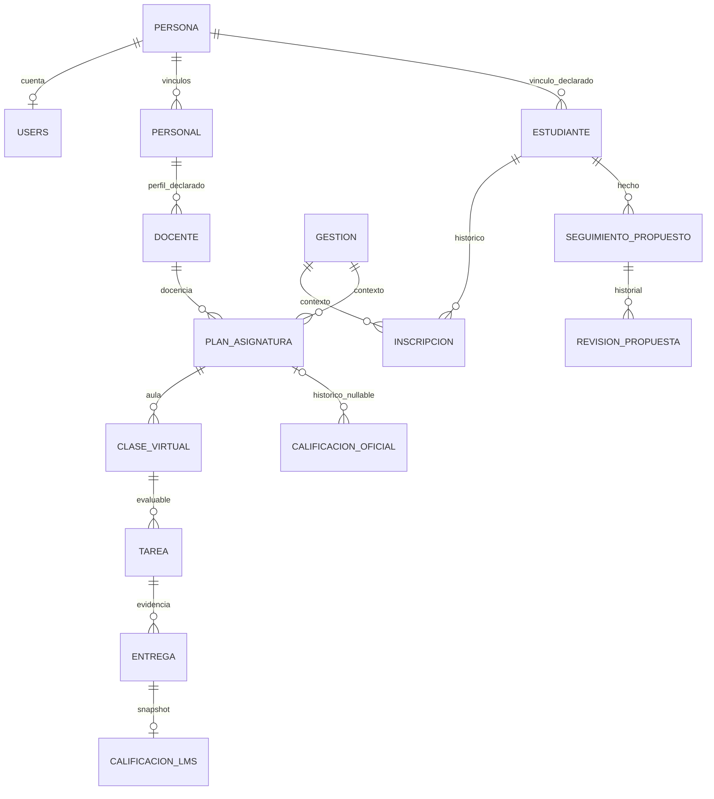

# Relaciones del modelo real y objetivo

Estado: propuesta para revisión arquitectónica, 2026-10-01. **No se consultó PostgreSQL.** Las cardinalidades siguientes se calculan por FK y UNIQUE declarados, no por el nombre `hasOne`. Fuente completa: [bd-relaciones-cardinalidad.csv](evidencia/bd-relaciones-cardinalidad.csv); [bd-modelos.csv](evidencia/bd-modelos.csv) conserva todas las relaciones Eloquent y argumentos.

## Propiedad y cardinalidades esenciales

| Relación | Declarado | Objetivo y dependencia histórica |
|---|---|---|
| Persona → User | 1:0..1; users.cod_per UNIQUE, DELETE CASCADE | Una identidad y cuenta opcional; estados en vez de borrar; evitar perder registros del autor. |
| Persona → Personal | 1:0..N; no UNIQUE cod_per | Resolver múltiples vínculos laborales históricos frente a uno vigente; cargo no es Role. |
| Persona → Estudiante | 1:0..N según FK; no UNIQUE cod_per | Definir un vínculo lógico de estudiante; inscripciones por gestión conservan historia. |
| Personal → Docente/perfiles | 1:0..N aunque modelos hasOne | Docente contiene especialidad y referencia de planes; preservar entidad; perfilar duplicados antes de UNIQUE. |
| User ↔ Role/Permission | M:N Spatie, PK compuestas y cod_usu textual | Un actor institucional en dominio; complementarios autorizados por RolePermissionService. Sin FK polimórfica a User en los pivots; no inferirla. |
| Gestión/Catálogo grupo → PlanAsignatura | 1:N por seis FK | Plan conserva gestión, grado, sección, jornada y docente. Curso es grado; no crear otro catálogo Grado equivalente. |
| Estudiante ↔ Gestión | N:M mediante InscripcionEstudiante; UNIQUE estudiante/gestión | Una inscripción lógica por gestión, cambios de grupo requieren historial; no copiar ni reescribir la matrícula anterior. |
| PlanAsignatura → ClaseVirtual | 1:N permitido por schema | No imponer 1:1 sin decidir varias aulas/ediciones; el Service conserva alcance del plan. |
| ClaseVirtual ↔ Estudiante | M:N con clase_estudiante | Membresía LMS no sustituye inscripción vigente; mantener cruces por las cuatro dimensiones del plan. |
| Clase → Publicación/Material/Tarea | 1:N | Autor y visibilidad son hechos; material adjunto a tarea tiene dueño distinto del material de aula. |
| Tarea → Entrega | 1:N; estudiante+tarea UNIQUE | Una entrega lógica, con devolución/rectificación; no perder intentos/archivos al conciliar duplicados. |
| Entrega → Archivo/Calificación LMS | 1:N archivos; UNIQUE cod_ent de calificación | Puntaje y máximo histórico no equivalen a nota oficial; preservar escala del momento. |
| Clase → Sesión asistencia → Marca estudiante | 1:N y 1:N; marca UNIQUE sesión/estudiante | Bloque nullable y estado en UNIQUE de sesión no expresan una identidad estable ante todas las escrituras. |
| Estudiante/Plan/Período → Nota oficial | 1:N; UNIQUE estudiante/plan/período admite plan nulo | El plan histórico nulo no se infiere; consulta legacy por asignatura sigue siendo necesaria. |
| Horario → Detalle → Plan curricular/técnico | 1:N; CHECK XOR planes | Bloque debe pertenecer a la plantilla y plan al mismo contexto del horario; FK individuales no garantizan toda esa coherencia. |
| Intento orientación → Respuestas/Resultado | 1:N respuestas; 1:0..1 resultado | Congelar edición e instrumento; cod_est duplicado debe coincidir. CASCADE no es política adecuada para borrar intento finalizado. |
| Seguimiento futuro → revisiones/evidencias | 1:N con RESTRICT | Dueño del hecho: KardexService; revisiones append-only. Bitácora registra la operación sin sustituir el historial de dominio. |
| Unidad futura → recursos | 1:N FK compuesta unidad/clase | UNIQUE(id,cod_cla) es soporte deliberado de integridad de contexto. No se asigna unidad a contenidos históricos por inferencia. |
| User → Notifications | 1:N institucional; interfaz Laravel usa morph | FK actual solo admite users; fijar discriminador y contrato antes de habilitar otros tipos. |
| Meta/Evento futuro → revisión | 1:N RESTRICT | Registro cancelado o corregido conserva autor, motivo y evento previo; sin borrado normal. |

## Grafo conceptual

## FK, historia y orden de dependencia

Las 96 FK históricas se cuentan separadas de las 128 del overlay hipotético de seis propuestas: MIG-006 reemplaza una FK y se añaden 32 nuevas netas. El overlay no demuestra aplicación. Cada FK, acción DELETE/UPDATE y fuente se conserva en los CSV. Las FK de horarios condicionadas por hasTable/hasColumn describen la intención sobre un schema completo, no prueban que se crearan en una base incompleta.

Identidad precede a cuenta/vínculos; catálogos académicos preceden a planes e inscripciones; plantilla precede a horario/bloques/detalle; plan precede a clase; clase precede a contenido/entrega/asistencia; intento precede a respuestas/resultados; nuevos catálogos preceden a seguimiento y luego a revisiones/evidencias. La futura aplicación debe basarse además en el ledger real de la BD aislada, no solo en el orden de nombres.

Históricos oficiales, orientación finalizada y revisiones: `IMMUTABLE_HISTORY`/`STATUS_BASED`. Sesiones, tokens y cache: `HARD_DELETE_ALLOWED` por expiración aprobada. No se adopta SoftDeletes universal: ningún Model local declara SoftDeletes. Borrado físico de personas y cascadas actuales exige cambio específico, no una flag cosmética.
