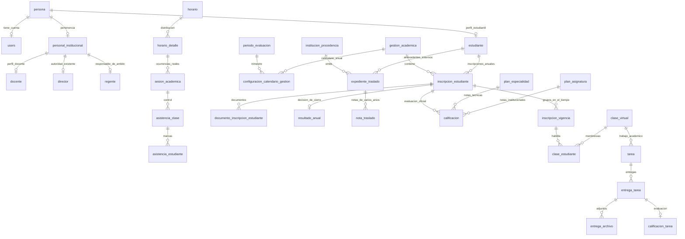

# Propuesta del modelo institucional de SAVP

Estado: **PROPUESTO, pendiente de revisión del usuario**. Fecha: 3 de octubre de 2026.

Este documento entrega el modelo y los cambios de esquema. No autoriza su ejecución. No se han ejecutado migraciones, seeders ni escrituras en la base para prepararlo. La creación de este documento no modifica la aplicación.

## 1. Base de la propuesta y límites de la evidencia

La fuente canónica es PostgreSQL, base `savp-tis3`, según el inventario de solo lectura guardado en `output/auditoria-estudiantil/postgresql-20261003.json`, generado el 3 de octubre de 2026 a las 22:12 UTC. Se contrastó con el checkout `C:\laragon\www\savp-reestructuracion`, rama `Fusion_Sistema`. Los conteos describen ese inventario, no una nueva consulta ni una garantía de que después no hayan cambiado.

Se identificaron **69 tablas físicas**. Hay 612 estudiantes, 600 inscripciones, una gestión —2026—, 48 docentes y tres configuraciones anuales de trimestre. `calificacion`, `calificacion_tarea`, `inscripcion_vigencia`, `sesion_academica`, `novedad_estudiante` y `seguimiento_academico` estaban vacías en ese inventario. La ausencia de filas no elimina la necesidad de esas entidades ni demuestra que sus restricciones estén completas.

Existe una diferencia entre estructura física y código: PostgreSQL contiene `inscripcion_vigencia`, `sesion_academica`, `novedad_estudiante` y `configuracion_calendario_gestion`, pero la búsqueda en `app`, migraciones y pruebas del checkout no encontró su integración con esos nombres. Por otra parte, `regente_asignaciones` está declarada en una migración, modelo, servicio y pruebas, pero no aparece entre las 69 tablas físicas. No se aplicará automáticamente ninguna migración pendiente para resolver esta diferencia.

SQLite queda fuera de las decisiones de este documento. No se leyó el contenido del PDF indicado por el usuario. Tampoco se tomó el diccionario documental anterior como prueba de lo que existe físicamente.

Las fechas oficiales de 2021–2026, equivalencias curriculares, escala de notas externas y reglas de promoción son cuestiones de datos y normativa que deben confirmarse antes de una futura carga. Aquí se diseña dónde conservarlas; no se inventan sus valores. Los datos sintéticos pertenecen a seeders y pruebas, sin nuevos indicadores de simulación en las entidades de producción.

## 2. Decisiones del modelo

1. Conservar los nombres existentes. Los atributos nuevos propios del dominio siguen **tres letras del atributo + `_` + tres letras de la tabla**: por ejemplo, `cod_ext`, `ani_ntr`, `res_ran`, `fii_pas`. Las FK mantienen el nombre del código de su madre, como `cod_est` o `cod_ins`.
2. No aprovechar la normalización para renombrar campos existentes como `ape_pat_per`, `cod_esp_tec`, `cod_asi_cla`, ni las columnas de Laravel/Spatie. Las excepciones preexistentes se documentan; no se extienden a atributos nuevos.
3. Separar persona, pertenencia institucional, perfil estudiantil/docente y cuenta de acceso. Una persona puede ser estudiante y personal sin copiar su identidad.
4. Una inscripción identifica al estudiante en una gestión. Sus vigencias identifican curso, paralelo, turno y especialidad durante intervalos concretos. Cambiar de grupo no reescribe una inscripción anterior.
5. Mantener los tres trimestres como catálogo reutilizable. Las fechas y el cierre de cada año pertenecen a la configuración anual ya existente.
6. Las asignaciones, horarios y sesiones referenciadas por hechos históricos conservan su identidad y contexto. Una sustitución de docente produce otra asignación, no un cambio retroactivo de `cod_doc`.
7. Separar estrictamente notas institucionales, notas externas y puntajes de tareas. Ninguna de estas tres categorías se convierte automáticamente en otra.
8. Proponer **tres tablas nuevas de dominio**: `expediente_traslado`, `nota_traslado` y `resultado_anual`. Proponer aparte materializar la relación `regente_asignaciones` ya declarada, con justificación y adaptación de sus campos al patrón institucional.
9. No crear solicitudes de promoción, repitencia, egreso, aprobaciones encadenadas, catálogos de cada estado, ni tablas por cada acción del usuario.
10. Validar 1FN, 2FN y 3FN con dependencias reales. No se requiere descomponer adicionalmente por BCNF si no se demuestra una anomalía concreta.

## 3. Relaciones principales propuestas

En `calificacion`, `clase_virtual` y `horario_detalle` la relación con los dos tipos de plan es **exclusiva**: asignatura o especialidad, nunca ambas en la misma fila. El diagrama muestra las alternativas, no una doble dependencia obligatoria. Los catálogos, referencias de autoría y el aporte se detallan a continuación.

## 4. Identidad, personal, cuentas y roles: actual → propuesto

| Tabla | Actual | Modelo propuesto | Cardinalidad y restricciones |
|---|---|---|---|
| `persona` | Identidad y contacto; CI y correo únicos individualmente | Mantener como madre de los datos personales; sin edad almacenada ni copias en hijos | PK `cod_per`. Revisar unicidad de documento con complemento, sin borrar complementos ni fusionar personas automáticamente |
| `users` | Cuenta con FK única `cod_per`; correo, contraseña, proveedores y seguridad | Mantener credenciales exclusivamente aquí. Correo de acceso puede diferir del contacto de persona; no igualarlos por obligación | Persona 1:0..1 cuenta. FK persona `RESTRICT` en vez de `CASCADE`. `UNIQUE(cod_per)`, correo de acceso único según política vigente |
| `personal_institucional` | `cod_pin`, persona, cargo textual y estado; persona no única | Una pertenencia por persona; `car_pin` es descripción laboral, no autorización RBAC ni lista de cargos | Persona 1:0..1 personal. `UNIQUE(cod_per)` después de reconciliar duplicados; FK `RESTRICT` |
| `docente` | Especialización y número de módulo propios; FK de personal no única | Conservar hija específica, sin repetir nombres, CI, correo o contraseña | Personal 1:0..1 docente. `UNIQUE(cod_pin)`; FK `RESTRICT`. Madre de asignaciones y autoría docente |
| `estudiante` | RUDE, persona, tipo, procedencia y especialidad actuales | Perfil estable con RUDE. Procedencia pasa a expediente; especialidad a vigencia; tipo de vinculación se vincula a cada inscripción | Persona 1:0..1 estudiante; `UNIQUE(cod_per)` y `UNIQUE(rud_est)`; FK persona `RESTRICT` |
| `director` | Código, personal y estado; el servicio de autoridad resuelve exactamente un director activo | Conservar por ahora como identidad de autoridad institucional ya utilizada; no crear otro perfil de director ni copiar persona | Personal 1:0..1 perfil; `UNIQUE(cod_pin)`. La regla existente de un director activo se protege en BD mediante unicidad parcial. Su eventual historia de nombramientos no se inventa aquí |
| `regente` | Código, personal y estado; modelo de asignación depende de esta identidad | Conservar como responsable de asignaciones de ámbito; su justificación es la relación real con gestiones y grados, no el permiso de entrar a una pantalla | Personal 1:0..1 perfil; `UNIQUE(cod_pin)`; hija `regente_asignaciones`; FK `RESTRICT` |
| `administrador` | Solo código, FK personal y estado | Candidata a retiro: las autorizaciones ya están en RBAC y no se ha encontrado atributo específico en su estructura | Mantener íntegra durante transición; no retirar hasta demostrar equivalencia de estados y todos sus consumidores |
| `secretaria_general` | Solo código, FK personal y estado | Candidata a retiro por el mismo motivo; secretaría continúa como rol de una cuenta vinculada a personal | Mismo requisito de comprobación; no borrar ni transformar hoy |
| `roles`, `permissions`, `model_has_roles`, `model_has_permissions`, `role_has_permissions` | RBAC de Spatie | Conservar su estructura y convenciones del paquete; pivotes únicamente para las N:M reales | Unicidad compuesta de los pares y FKs coherentes con `users.cod_usu`; no interpretar `car_pin` como permiso |

**No se certifica que una tabla de cargo sea redundante solo por ser pequeña.** `director` tiene referencias funcionales en `InstitutionalAuthorityService` y `RoleRequestService`; `regente` es madre del ámbito usado por `RegencyAccessService`. `administrador` y `secretaria_general` aparecen en modelos, relaciones de `PersonalInstitucional`, Support de personas y migraciones. Es evidencia para revisar, no un inventario exhaustivo de dependencias ni autorización para eliminarlas.

Antes de modificar la unicidad de CI se debe verificar la semántica de `ci_per`, `com_per` y `exp_per`. Si número y complemento identifican el documento, la propuesta es unicidad sobre número y complemento normalizado, con NULL tratado como ausencia de complemento. No se propone cambiar esa clave solamente porque existe una columna llamada complemento. Tampoco se impone que toda persona menor de edad disponga de correo de contacto propio; eso debe resolverse con la regla institucional, sin inventar direcciones para satisfacer un `NOT NULL`.

`est_per`, `est_pin`, `est_doc`, `est_est` y `est_usu` representan habilitaciones de entidades diferentes. No se eliminan como si fueran siempre el mismo booleano. Egresar o retirar a un estudiante puede desactivar su perfil/cuenta según política, pero conserva persona, inscripciones y evidencias.

## 5. Catálogos y calendario académico

| Tabla | Madre/hijos o relación | Actual → propuesto | Claves y reglas propuestas |
|---|---|---|---|
| `gestion_academica` | Madre de inscripciones, configuración, asignaciones, horarios, eventos y respaldos | Mantener año, límites y estado; no una tabla distinta por año | PK `cod_gea`; `UNIQUE(ani_gea)` para la institución actual; `fii_gea <= ffi_gea`; cierre no elimina hijos |
| `periodo_evaluacion` | Catálogo de los tres trimestres; hijo anual en configuración | Hoy también guarda gestión y fechas de 2026. Separar catálogo de ocurrencia anual | PK `cod_pev`; orden único 1–3. Conservar nombre/estado. Retirar sus fechas y gestión únicamente después del traslado validado |
| `configuracion_calendario_gestion` | Relación gestión–trimestre con fechas y reglas propias | Reutilizar la tabla física; agregar `cod_pev` y `cie_ccg`. Mantener `fii_tri_ccg`, `ffi_tri_ccg`, `dias_req_ccg`, `est_ccg` | PK `cod_ccg`; FKs gestión/periodo `RESTRICT`; `UNIQUE(cod_gea,cod_pev)`; fechas válidas y contenidas en gestión; no superponer periodos |
| `curso` | Catálogo de grados, referenciado por vigencias y planes | Conservar nombre y nivel; agregar `ord_cur smallint` para grado ordenado dentro del nivel, sin mezclar grado con paralelo o año | PK `cod_cur`; `UNIQUE(niv_cur,ord_cur)` cuando se complete el mapeo acreditado; `ord_cur > 0`. No inferir número de grado cortando texto para decidir promociones |
| `paralelo` | Catálogo reusable A/B/C/D, etc. | Mantener; grupo real es su contexto de grado/turno/gestión | PK `cod_par`; nombre normalizado único dentro del catálogo actual |
| `turno` | Catálogo con horario propio; madre de plantillas y contexto de vigencias/planes | Conservar | PK `cod_tur`; inicio anterior a fin; unicidad del nombre según catálogo |
| `asignatura` | Materia institucional, madre de planes | Conservar identidad; `hor_asi` solo si significa carga curricular de referencia | PK `cod_asi`; no unir materias por similitud de nombre. `hor_pas` es carga asignada, distinta de referencia y horas impartidas |
| `especialidad_tecnica` | Catálogo BTH, madre de planes y contexto de vigencias | Conservar separada de materias | PK `cod_esp`; no duplicar la especialidad vigente en `estudiante` |
| `institucion_procedencia` | Entidad de origen, madre de expedientes | Reutilizar nombre, tipo y ciudad; no texto de origen repetido por nota/año | PK `cod_ipe`; no imponer `UNIQUE(nom_ipe)` sin identificador oficial: pueden existir instituciones homónimas |
| `tipo_vinculacion_estudiante` | Catálogo descriptivo utilizado por inscripción | Conservar su identidad, trasladar referencia al hecho anual cuando esa sea su semántica | PK `cod_tve`; agregar FK `cod_tve` a inscripción. `tip_ins` sigue siendo modalidad administrativa si es distinta; si expresa lo mismo, retirar el duplicado tras reconciliar el vocabulario |
| `estado_asistencia` | Catálogo con ponderación, descripción y reglas | Conservar: tiene metadatos y semántica propia, no es un estado trivial | PK `cod_est_asi`; abreviatura única; porcentaje válido 0–100. Cambiar una regla usada históricamente exige otra versión/código, no sobreescribirla |
| `calendario_evento` | Evento fechado de gestión; ámbito opcional y referencias a evento anterior/origen | Conservar la tabla existente, documentos/fuentes y efecto sobre clases; no crear tabla de solicitud de feriado o suspensión | PK `cod_cae`; FKs `RESTRICT`; fechas/horas coherentes; sin ciclos en referencias. Distinguir evento informativo de efecto confirmado |

`num_tri_ccg` se utiliza para mapear el inventario actual a `periodo_evaluacion.ord_pev`; después se propone retirarlo porque ese número ya lo determina `cod_pev`. No se renombra masivamente ninguna columna: se mueve el hecho anual a su entidad correcta. `cie_ccg` es fecha/hora de cierre oficial, nullable mientras no hay cierre. Su valor no se calcula a partir de la fecha final de clases.

Las fechas curriculares no se calculan automáticamente desde días exigidos. Vacaciones, suspensiones y recuperaciones se conservan en eventos y sesiones. Si un evento refiere a `cod_hde`, su año y grupo se obtienen del detalle. La propuesta hace nullable `calendario_evento.cod_gea` y exige uno de dos ámbitos: (a) gestión directa NOT NULL, detalle NULL y filtros opcionales de turno/curso/paralelo; (b) detalle NOT NULL y gestión/filtros directos NULL. Se protege mediante CHECK y vistas de consulta, después de conciliar los eventos existentes. No se pierde el ámbito institucional de un evento sin detalle horario ni se guardan dos contextos contradictorios.

## 6. Inscripción anual e historia de grupo

### 6.1 `inscripcion_estudiante`

Representa **la inscripción de un estudiante en una gestión**, no su último curso. Madres: `estudiante`, `gestion_academica` y catálogos administrativos pertinentes. Hijas: vigencias, documentación, calificaciones y resultado anual.

Se conserva PK `cod_ins` y `UNIQUE(cod_est,cod_gea)`. Esa regla actual permite una inscripción anual con varias vigencias, incluso retiro y reingreso en el mismo año; no se crea una segunda inscripción para simular un cambio de paralelo.

Campos finales del núcleo anual: `cod_ins`, `cod_est`, `cod_gea`, `cod_tve` cuando se confirme su semántica anual, `fei_ins`, `tip_ins`, `con_ins`, `est_ins`, `obs_ins`, `mot_obs_ins`, `sob_aut_ins`, `sie_ins`, `fec_sie_ins`, `fec_con_ins`, `fec_anu_ins`, `mot_anu_ins`, `fec_ret_ins`, `mot_ret_ins` y marcas técnicas existentes. Los estados y fechas actuales se conservan con sus CHECK; los motivos obligatorios siguen correspondiendo al acto real.

Cambios propuestos:

- Trasladar `cod_cur`, `cod_par`, `cod_tur`, `cod_esp_tec`, `est_esp_tec_ins` y `obs_esp_tec_ins` a vigencia. Las dos últimas se conservarán como campos existentes en la hija durante compatibilidad, sin renombrarlas; se requiere confirmar si describen todo el año o el intervalo antes de retirar su original.
- Retirar `doc_com_ins` como dato autoritativo calculable desde documentos y sus reglas. Exponer completitud mediante consulta; no marcarla verdadera independientemente de los documentos.
- Resolver `pro_ins`: cuando sea institución de origen, sustituir texto repetido por FK opcional `cod_ext` a expediente. El texto anterior se conserva durante conciliación; no se convierte automáticamente en un catálogo ni se desecha si contiene otra información.
- No borrar las inscripciones de personas egresadas. `ARCHIVADA` no equivale a inexistente.

La madre puede existir sin vigencia mientras es preinscripción/pendiente. Para pasar a una condición que representa escolarización efectiva debe existir la vigencia válida correspondiente. Se protege en BD con trigger de restricción diferible y en Laravel con validación independiente, sin obligar al usuario a una solicitud nueva.

### 6.2 `inscripcion_vigencia` — reutilización, no tabla nueva

PK `cod_ivg`; madre `cod_ins`; FKs `cod_cur`, `cod_par`, `cod_tur`, `cod_esp_tec` opcional. Campos propios existentes: `fii_ivg`, `ffi_ivg`, `tip_ivg`, `cie_ivg`, `mot_ivg`, `est_ivg`. La especialidad y su condición temporal pertenecen aquí cuando describan el intervalo.

Cardinalidad: inscripción 1:N vigencias, con **como máximo una abierta y sin intervalos efectivos superpuestos**. Se mantiene la regla actual de cierre y motivo. La propuesta usa fechas inclusivas: si el nuevo grupo empieza el 10 de mayo, el anterior termina el 9 de mayo. Si se confirma necesidad de cambios dentro del mismo día, deben proponerse horas y una precisión temporal distinta antes de implementar; no fingir que fechas permiten distinguirlos.

El índice `uq_ivg_activa` aparece como único sobre `cod_ins` en la introspección, pero esta evidencia no incluye su predicado. Antes de reutilizarlo se debe revisar su definición exacta: la intención es UNIQUE parcial para vigencia abierta, **no** UNIQUE global que convertiría 1:N en 1:1. La exclusión de solapamientos necesita una restricción temporal PostgreSQL o un trigger con bloqueo de la inscripción; un CHECK de una fila no detecta el cruce con otra.

La inscripción no repite el grupo vigente una vez completada la transición. Una vista puede reconstruir grupo actual o grupo a fecha, sin convertirse en otra tabla de almacenamiento.

## 7. Tres tablas nuevas necesarias

Los códigos nuevos usan `varchar(20)` y el mecanismo seguro de generación institucional que se acuerde en implementación. Una secuencia PostgreSQL puede producir códigos con el prefijo existente; `MAX(código)+1` no protege concurrencia. No se modifican códigos ya emitidos.

### 7.1 `expediente_traslado` — sufijo `ext`

**Entidad:** conjunto documental de antecedentes académicos externos recibido para un estudiante desde una institución concreta. Su identidad es el expediente/documento recibido, no cada año de las notas que contiene.

**Madres:** `estudiante` e `institucion_procedencia`. **Hija:** `nota_traslado`. **Referencias adicionales:** documento de inscripción opcional y una o varias inscripciones que lo utilizan. **Cardinalidades:** estudiante 1:N expedientes; institución 1:N expedientes; expediente 1:N notas y 1:N inscripciones que lo referencian. Una inscripción puede no necesitar expediente.

| Campo | Tipo propuesto | Obligatoriedad / significado |
|---|---|---|
| `cod_ext` | varchar(20) | PK, NOT NULL |
| `cod_est` | varchar(20) | FK a estudiante, NOT NULL, `RESTRICT` |
| `cod_ipe` | varchar(20) | FK a institución de procedencia, NOT NULL, `RESTRICT` |
| `ref_ext` | varchar(120) | Referencia real del expediente/certificado, NULL si no tiene número |
| `fec_ext` | date | Fecha real de recepción, NOT NULL |
| `cod_die` | varchar(20) | FK opcional al documento de inscripción existente, `RESTRICT` |
| `est_ext` | varchar(20) | Dominio controlado `ACTIVO`/`ANULADO`, NOT NULL |
| `obs_ext` | text | Observaciones de procedencia, opcionales |

**UNIQUE:** `(cod_est,cod_ipe,ref_ext)` solo para referencias no vacías/no nulas. Una referencia ausente no se sustituye por un número ficticio. La PK identifica cada expediente sin número; se controla duplicidad documental antes de registrar otro. No imponer una cabecera por año ni una cabecera única de por vida por estudiante/origen: pueden existir documentos independientes de retornos o nuevos traslados.

**Integridad:** si se vincula `cod_die`, su inscripción debe pertenecer al mismo estudiante. Si una inscripción refiere `cod_ext`, también debe pertenecer al mismo estudiante. Son reglas cruzadas de BD con bloqueo apropiado; no basta el formulario. No copiar nombre de institución, ciudad o nombre del alumno en cada nota.

**Anomalía evitada:** actualizar el origen en una ficha única no debe alterar ni hacer desaparecer antecedentes de otros traslados. La cabecera común evita repetir procedencia/documento por año y por materia.

### 7.2 `nota_traslado` — sufijo `ntr`

**Hecho:** calificación que consta en un antecedente externo. **Madre:** `expediente_traslado`. **Hijos:** ninguno. **Cardinalidad:** expediente 1:N notas, incluyendo varios años. Las equivalencias opcionales apuntan a catálogos, no convierten el hecho en nota institucional.

| Campo | Tipo propuesto | Obligatoriedad / significado |
|---|---|---|
| `cod_ntr` | varchar(20) | PK, NOT NULL |
| `cod_ext` | varchar(20) | FK madre, NOT NULL, `RESTRICT` |
| `ani_ntr` | smallint | Año de origen, NOT NULL; no FK obligatoria a gestión local |
| `cur_ntr` | varchar(120) | Curso/nivel tal como consta en el antecedente, NOT NULL |
| `mat_ntr` | varchar(180) | Materia original del antecedente, NOT NULL |
| `per_ntr` | varchar(80) | Periodo original: trimestre/bimestre/anual según documento, NOT NULL |
| `not_ntr` | numeric(8,2) | Calificación original, NOT NULL; no normalizarla silenciosamente |
| `esc_ntr` | varchar(80) | Escala declarada por el antecedente, NOT NULL; por ejemplo `0–100` únicamente si está acreditada |
| `cod_cur` | varchar(20) | Equivalencia local de curso, opcional, FK `RESTRICT` |
| `cod_asi` | varchar(20) | Equivalencia local de materia, opcional, FK `RESTRICT` |
| `cod_pev` | varchar(20) | Equivalencia local de periodo, opcional, FK `RESTRICT` |
| `obs_ntr` | text | Aclaraciones del antecedente, opcionales |

**UNIQUE:** `(cod_ext,ani_ntr,cur_ntr,mat_ntr,per_ntr)` para una calificación consignada por ese documento/contexto. Si el documento distingue convocatorias u oportunidades, esta clave no es suficiente: se debe revisar esa necesidad antes de agregar datos, no deduplicar resultados diferentes. La cadena original y su equivalencia local son hechos distintos; no son dos copias del mismo nombre.

**CHECK:** año válido y textos no vacíos; la nota se valida contra la escala acreditada. El CHECK institucional 0–100 no se aplica a cualquier escuela de origen sin comprobar su escala. La estructura numérica cubre antecedentes numéricos; un antecedente cualitativo requerirá revisión explícita del tipo de calificación, no inventar un número. `esc_ntr` registra la escala de esa nota original; si un formato acredita escala única de todo el expediente, se debe mover ese atributo a cabecera antes de cargarlo para evitar la dependencia `cod_ext → esc_ntr`. No se crea ahora un catálogo de escalas sin conocer el dominio documental.

No contiene `cod_doc`, `cod_pas`, `cod_pes`, copia de `cod_est` o copia de `cod_ipe`. Tampoco obliga a crear una gestión institucional de un año en el que el estudiante estaba en otro colegio. Las equivalencias NULL representan falta de equivalencia verificada; no una materia inventada ni una nota cero.

**Anomalía evitada:** notas anteriores quedan separadas de la responsabilidad docente local y de las inscripciones efectivamente realizadas en SAVP. Registrar antecedentes de seis años no obliga a crear seis expedientes.

### 7.3 `resultado_anual` — sufijo `ran`

**Hecho/decisión:** resolución institucional oficial del cierre académico de una inscripción anual. **Madre:** `inscripcion_estudiante`. **Hijos:** ninguno. **Cardinalidad:** inscripción 1:0..1 resultado; después de un cierre académico válido, 1:1. La ausencia de fila durante una gestión en curso no se sustituye por una resolución falsa llamada pendiente.

| Campo | Tipo propuesto | Obligatoriedad / significado |
|---|---|---|
| `cod_ran` | varchar(20) | PK, NOT NULL |
| `cod_ins` | varchar(20) | FK madre, NOT NULL, UNIQUE, `RESTRICT` |
| `res_ran` | varchar(20) | Resultado oficial, NOT NULL; dominio inicial propuesto `PROMOVIDO`, `REPROBADO`, `EGRESADO` |
| `fec_ran` | timestamp with time zone | Fecha/hora de resolución, NOT NULL |
| `cod_usu` | varchar(20) | Cuenta responsable del registro oficial, NOT NULL, FK `RESTRICT` |
| `ref_ran` | varchar(120) | Referencia del acta/resolución de cierre, NOT NULL para resultado definitivo |
| `obs_ran` | text | Observación excepcional, opcional |

El dominio de resultados se revisará con la institución. Retiro administrativo ya tiene hecho y fechas en inscripción; no se clasifica automáticamente como reprobación ni se añade un cuarto resultado sin definición. `REPROBADO` registra la decisión; repetir se evidencia en una inscripción posterior con el grado correspondiente. No se guarda curso siguiente calculable ni fecha de nacimiento, estudiante o año duplicados.

**UNIQUE:** `cod_ins` asegura 1:1. **CHECK:** resultado perteneciente al dominio, referencia no vacía. **Reglas cruzadas:** resultado solo para inscripción válida y cierre oficial aplicable; egreso exige haber completado el nivel pertinente conforme a regla institucional. No convertir el clasificador de riesgo de Laravel —que actualmente distingue notas 0–50— en una regla automática de promoción anual.

No contiene promedio trimestral/anual, ranking, cantidad de aprobadas, porcentaje de asistencia ni otros agregados reconstruibles. La referencia del acta acredita la decisión y su autoridad; `cod_usu` identifica al registrador, no presupone que ese usuario sea la autoridad firmante. Si se requiere identidad de firmante como dato estructurado adicional, se debe revisar explícitamente; no confundir ambos roles.

**Anomalía evitada:** cambiar el curso actual o el estado de la cuenta no borra ni altera la decisión de la gestión anterior. Una fila de cierre no obliga a solicitudes de promoción/repitencia/egreso.

La decisión y sus notas oficiales se congelan al cierre. Una rectificación futura exige autorización institucional vigente, conservación de valores anterior/nuevo, fecha, responsable y motivo en la bitácora existente, de forma atómica. No se propone otra tabla de workflow. Si se exige un historial inmutable de múltiples actas rectificatorias como registros de dominio consultables, se deberá revisar ese requisito antes de afirmar que la bitácora lo reemplaza.

## 8. Planes, horarios y sesiones

| Tabla | Hecho y madres | Actual → propuesto | Claves / integridad |
|---|---|---|---|
| `plan_asignatura` | Asignación de docente–materia a grupo y gestión | Conservar y agregar `fii_pas`, `ffi_pas` para vigencia temporal; no cambiar docente de un plan usado en historia | PK `cod_pas`. FK materia/docente/curso/paralelo/turno/gestión `RESTRICT`; clave candidata con ese contexto más inicio; fin >= inicio |
| `plan_especialidad` | Asignación docente–especialidad a grupo y gestión | Conservar y agregar `fii_pes`, `ffi_pes`; adaptar UNIQUE actual para permitir intervalos diferentes del mismo docente | PK `cod_pes`; FKs `RESTRICT`; clave candidata equivalente; validar vigencia |
| `plantilla_horaria` | Configuración de bloques del turno | Conservar; una plantilla utilizada por sesiones cerradas no se edita retroactivamente | PK `cod_pho`; FK turno `RESTRICT`; fechas y duración válidas. Otra distribución crea nueva plantilla |
| `horario_bloque` | Bloque de una plantilla | Conservar la relación 1:N | PK `cod_hbl`; `UNIQUE(cod_pho,num_hbl)` si no está ya garantizado; inicio < fin; no superponer bloques lectivos incompatibles |
| `horario` | Horario del grupo/gestión asociado a plantilla | Conservar; el turno se deriva de plantilla, no agregar otra copia. Agregar `fii_hor`, `ffi_hor` para versiones temporales | PK `cod_hor`; FKs `RESTRICT`; reemplazar unicidad de grupo/plantilla por contexto con inicio si impide versiones necesarias; versiones efectivas no superpuestas |
| `horario_detalle` | Asignación a bloque/día de un horario | Conservar XOR de `cod_pas`/`cod_pes`, ya presente en PostgreSQL | PK `cod_hde`; `UNIQUE(cod_hor,cod_hbl,dia_hde)` existente. Cambiar FK de horario `CASCADE` a `RESTRICT`; verificar bloque pertenece a plantilla y plan al mismo contexto |
| `sesion_academica` | Ocurrencia real del detalle horario en una fecha | Reutilizar tabla física. Retirar `cod_gea` después de verificar que se obtiene de detalle→horario | PK `cod_ses`; `UNIQUE(cod_hde,fec_ses)` actual; FKs `RESTRICT`; fecha dentro de versión pertinente; referencias a recuperación/origen sin ciclos |

Las cargas `hor_pas`/`hor_pes` son asignadas; `hor_pla_ses` es la carga programada para esa sesión y `hor_rea_ses` la realizada. Se conservan las horas de sesión como evidencia histórica, con unidad definida, y no se recalculan desde una plantilla posteriormente cambiada. La suma impartida se consulta; no se duplica en otra tabla anual.

Un plan puede tener varias clases virtuales si ya existen necesidades distintas; no imponer 1:1 sin respaldo. La unicidad de contexto docente/inicio evita duplicados exactos. Prohibir toda docencia concurrente o permitir codocencia requiere regla institucional explícita: el esquema no inventa cuál es válida. Se deben bloquear choques horarios efectivos de docente y de grupo con validación en BD bajo concurrencia.

Una sesión suspendida/cancelada no debe producir ausencias como si hubiese clases. Una recuperación se conserva con fecha real y referencia de origen; no reubica el hecho histórico original. Si se requieren varias sesiones independientes del mismo detalle en una misma fecha, se deberá ampliar la clave actual con una hora/secuencia real después de confirmar ese caso.

## 9. Asistencia, retrasos, licencias y seguimiento

| Tabla | Entidad y cardinalidad | Propuesta |
|---|---|---|
| `asistencia_clase` | Acto de control de asistencia de una clase virtual para una sesión; sesión y clase 1:N controles, control 1:N marcas | Agregar FK `cod_ses` a la sesión existente. `UNIQUE(cod_ses,cod_cla)` para el control único de esa combinación. Conservar registrador, docente que efectivamente controla, tipo, apertura/cierre y observaciones. No confundir control con sesión impartida |
| `asistencia_estudiante` | Marca de estudiante en un control | Conservar PK, `cod_asi_cla`, `cod_est`, `cod_est_asi`, registrador, minutos y observación. UNIQUE actual control/estudiante. Validar escolarización y membresía efectivas en la fecha de sesión; no agregar una FK anual redundante solo para facilitar consultas |
| `novedad_estudiante` | Licencia/justificación u otra novedad individual con intervalo, motivo y respaldo propios | Reutilizar la tabla existente. Su gestión ya está representada: propuesta agregar `cod_ins` y retirar `cod_est`,`cod_gea` después de conciliación; la novedad se refiere al vínculo anual, no a un usuario solicitante |
| `seguimiento_academico` | Intervención/acompamiento real con responsable, apertura, próxima acción, cierre y resolución | Conservar porque tiene ciclo de vida propio. Agregar `cod_ins` cuando corresponde al seguimiento anual ya representado; retirar `cod_est`,`cod_gea` redundantes tras conciliación. No crear un nuevo circuito de solicitud/aprobación |

En `asistencia_clase`, `cod_hbl` y `fec_asi_cla` pasan a obtenerse de la sesión cuando significan bloque/fecha de clase. Las horas de apertura/cierre del control se conservan si registran un hecho distinto de las horas programadas. No se retiran horarios reales para sustituirlos por los de la plantilla. Los registros manuales históricos sin detalle identificable se mantienen sin inventar una sesión; su conciliación es una condición previa a exigir `cod_ses NOT NULL`.

Para relacionar una marca de licencia/justificación con su evidencia, se propone FK opcional **`cod_nes` en `asistencia_estudiante`** a la novedad existente. Novedad 1:N marcas. No nace una tabla pivote porque una marca solo requiere una justificación vigente como respaldo; si existen múltiples respaldos independientes por marca, primero se verifica ese requisito. BD comprueba mismo estudiante/año y fecha incluida en el intervalo. El motivo o documento común no se copia en cada marca.

CHECK: `min_retraso >= 0`; estados que requieren observación la exigen; minutos de retraso deben ser coherentes con el estado seleccionado. El cálculo de asistencia respeta `afecta_asistencia` y la regla vigente del catálogo; licencia/justificado no se cuentan silenciosamente como presencia física. No se crea un total anual almacenado. Sin marca registrada no significa ausencia ni presencia.

Para novedades y seguimientos sin inscripción anual comprobable, no se crea una inscripción ficticia como backfill. Se conservarán los registros originales y se revisará si realmente son hechos independientes de inscripción antes de hacer obligatoria la nueva FK.

## 10. Aula virtual, tareas, entregas y notas

| Tabla | Madre / cardinalidad real | Actual → propuesto / restricciones |
|---|---|---|
| `clase_virtual` | Plan de asignatura **o** especialidad 1:N clases | Mantener PK `cod_cla`, nombres/descripción/fechas/estado; asegurar XOR también aquí. Gestión, docente y materia se obtienen del plan; no agregarlos duplicados |
| `clase_estudiante` | Relación real N:M entre clases y trayectos de estudiantes, con alta/retiro/acceso propios | Reutilizar pivote. Agregar `cod_ivg` FK vigencia, después retirar `cod_est` derivable. `UNIQUE(cod_cla,cod_ivg)` permite membresías correspondientes a reingresos y cambios reales; fechas de participación dentro de vigencia y asignación |
| `publicacion_clase` | Clase 1:N publicaciones, usuario autor | Conservar contenido, tipo y ciclo publicación/ocultación/anulación; no tablas por acción |
| `material_clase` | Material de clase, opcionalmente ligado a publicación | Si `cod_pub` está presente, clase se deriva de publicación: aplicar XOR entre `cod_pub` y `cod_cla` directo, haciendo la FK directa nullable. Vistas resuelven clase efectiva; no duplicar esa dependencia transitiva. FK publicación pasa de `SET NULL` a `RESTRICT` para conservar el contexto |
| `tarea` | Clase 1:N tareas; docente autor/responsable propio | Agregar `cod_pev` FK al trimestre explícito. Conservar título, descripción, publicación, plazo, puntaje máximo y permiso de entrega tardía. No añadir año/materia/curso/docente del horario como copias automáticas |
| `tarea_material` | Tarea 1:N adjuntos/enlaces propios | Mantener FK en hija; no pivote mientras un adjunto pertenece a una tarea |
| `entrega_tarea` | Tarea 1:N entregas oficiales, cada una de un estudiante | Conservar `UNIQUE(cod_tar,cod_est)`, fecha, texto, estado y observación; comprobar pertenencia a la clase en la fecha pertinente. No inventar intentos múltiples cuando el contrato actual guarda una entrega por alumno/tarea |
| `entrega_archivo` | Entrega 1:N archivos | Mantener metadatos y FK `RESTRICT`; archivo no es entrega distinta |
| `calificacion_tarea` | Entrega 1:0..1 evaluación registrada por docente | Mantener FK UNIQUE `cod_ent`; retirar `cod_tar` y `cod_est`, determinados por entrega. Conservar `cod_doc` como evaluador real, `pun_obt`, `pun_max`, comentario, fecha y estado |
| `actividad_clase` | Evento de uso/actividad de la clase | Conservar como traza, no como calificación ni asistencia oficial. JSON de contexto variable permitido; referencias genéricas no sustituyen las FK del dominio |
| `calificacion` | Nota oficial de inscripción para trimestre y una asignación institucional | Agregar `cod_ins`, `cod_pes` opcional. Conservar `cod_pas`, `cod_pev`, nota/observación/estado. Retirar `cod_est` y `cod_asi` derivados. XOR de planes; se explica unicidad oficial debajo |

`cant_acc_cla_est`, `ult_acc_cla_est` y `ult_act_cla_est` son agregados de eventos. Se propone consultar esos datos desde `actividad_clase` y retirar las copias únicamente si la traza conserva todo el historial necesario. Si actualmente solo se incrementa un contador sin registrar todos los eventos, no se destruye esa evidencia: se documenta como resumen legado no reconstruible y se define su conservación antes del retiro. No se justifica la persistencia futura por comodidad sin medir necesidad.

El puntaje máximo de una evaluación de tarea puede conservarse como **snapshot del instrumento utilizado al calificar**, para que una edición posterior no cambie el significado del puntaje otorgado. Esta excepción requiere congelar el instrumento al calificar, o registrar explícitamente la escala aplicada. No equivale a duplicar un máximo actual sin regla histórica. CHECK: máximo positivo, puntaje entre cero y máximo. Una nota cero es un valor real, no la representación de una entrega inexistente.

`tarea.cod_pev` indica el periodo curricular al que se asignó el trabajo; la entrega tardía puede ocurrir después. No recalcular el trimestre a partir de una nueva fecha límite. La gestión se obtiene del plan de la clase y debe disponer de configuración para ese trimestre. La numeración `TAREA #...` solicitada para futuros seeders es una presentación de tareas, no una nueva entidad ni una regla de unicidad curricular.

### 10.1 Clave de la calificación oficial

Campos propuestos finales: `cod_cal`, `cod_ins`, `cod_pas` **o** `cod_pes`, `cod_pev`, `not_cal`, `obs_cal`, `est_cal` y marcas existentes. FKs `RESTRICT`. Se mantiene CHECK 0–100 para las notas institucionales, según la regla actual comprobada. No se exige que una nota trimestral sea el promedio simple de tareas: falta la regla institucional de evaluación y ponderación.

Se requieren dos niveles de integridad:

1. Índices UNIQUE parciales `(cod_ins,cod_pas,cod_pev)` y `(cod_ins,cod_pes,cod_pev)` para la alternativa seleccionada, con la semántica de anulación acordada.
2. **Una única nota oficial efectiva por inscripción, materia/especialidad y trimestre, aunque haya cambiado el docente o el código de plan.** La identidad de materia se obtiene del plan. Un trigger de restricción consulta esa identidad y bloquea la inscripción al validar escrituras concurrentes; no se almacena otra copia de `cod_asi` solo para construir un UNIQUE sencillo.

La segunda regla no se resuelve con un CHECK ni con un índice sobre una consulta a otra tabla. Es una restricción cruzada explícita del modelo, que necesitará implementación PostgreSQL revisada. Los planes referenciados son inmutables en su identidad de materia/especialidad/gestión; modificar la madre tampoco puede invalidar las notas existentes. La estructura no incluye dos notas finales del mismo trimestre para sumar al alumno por cada docente que tuvo.

La inscripción y plan deben coincidir en gestión, y el plan debe ser aplicable a un intervalo del estudiante durante ese periodo. La fecha de registrar la nota puede ser posterior al fin de clases: no se confunde fecha de captura con fecha del aprendizaje. Una transición a otro colegio durante el trimestre puede incluir antecedente externo y nota local; no se mezclan aritméticamente sin regla oficial de consolidación confirmada.

Las notas con plan NULL en un histórico real no se completan buscando simplemente el docente actual de la materia. Se conserva la fuente y se deja la conciliación pendiente hasta contar con evidencia. En el inventario canónico esta tabla estaba vacía, pero la futura migración debe volver a comprobarlo.

## 11. Documentos, respaldos y auditoría

| Tabla | Entidad / madre | Propuesta |
|---|---|---|
| `documento_inscripcion_estudiante` | Documento requerido/presentado de una inscripción; 1:N | Conservar tipo, estado, obligatoriedad, presentación, ubicación, formato, tamaño y hash. FKs `RESTRICT`. No marcar VALIDADO solo por existir un archivo ni exigir contenido ficticio |
| `respaldo_gestion_academica` | Artefacto exportado de gestión; 1:N | Conservar; un archivo generado requiere ubicación, tamaño y hash coherentes. Un preliminar puede existir sin cierre; un cierre corresponde a datos congelados. No tabla por año |
| `reportes_generados` | Artefacto de reporte general con autor y archivo | Conservar convención existente, distinto del respaldo íntegro anual; no duplicar un artefacto de cierre en dos tablas sin finalidad distinta |
| `bitacora` | Evento de auditoría | Conservar valores anterior/nuevo y metadatos semiestructurados. Retención protegida; no cascada por eliminar usuario. No usarla para almacenar las notas oficiales en JSON |
| `user_status_logs` | Cambio de habilitación de cuenta | Conservar con actor, motivo y fecha; no tabla de solicitudes nuevas |

En el código inspeccionado, `GestionAcademica::generarRespaldo()` inserta metadatos de un JSON pero no genera allí un archivo ni su ruta/hash. Por tanto, ese registro por sí solo **no prueba que haya una descarga anual real**. El modelo ya dispone de entidad para corregirlo en una fase autorizada; no hace falta inventar una tabla de descarga, una por gestión, ni un workflow.

Se debe revisar el CHECK actual de fechas de documentación: no debe prohibir presentar antes de una fecha límite ni usar el estado para ocultar una contradicción temporal. Fecha límite y fecha de presentación son hechos distintos. Hash y tamaño son metadatos del artefacto, no promedio calculable académico.

El mismo PDF podrá reutilizarse físicamente en una futura carga sintética, según autorización del usuario, manteniendo registros de documento por inscripción. No se introduce una entidad de almacenamiento deduplicado sin necesidad propia; al eliminar un archivo habrá que verificar referencias compartidas. Este documento no ha abierto ni interpretado ese PDF.

## 12. Aporte académico-vocacional separado

El aporte consume identidad estudiantil e historia institucional autorizada. No decide promoción, no cambia inscripciones y no convierte afinidad o ranking en nota oficial. Se mantienen las cinco tablas físicas actuales; no se agregan aquí carreras, solicitudes, aprobaciones, chats o evaluaciones institucionales por conveniencia del aporte.

| Tabla del aporte | Relación real y tratamiento propuesto |
|---|---|
| `orientacion_actividades` | Aplicación del cuestionario a estudiante en contexto de gestión; conservar `id` y campos existentes. Gestión histórica y revisor no deben perderse por `SET NULL` al eliminar sus madres: proponer `RESTRICT` cuando sean evidencia de la aplicación |
| `orientacion_preguntas` | Pregunta con dimensión, tipo, orden y visibilidad propios; conservar. Preguntas ya respondidas se congelan; otra redacción significativa obtiene otra identidad en vez de editar el pasado |
| `orientacion_respuestas` | Relación aplicación–pregunta con respuesta propia; `UNIQUE(orientacion_actividad_id,orientacion_pregunta_id)` existente. Retirar `cod_est` determinado por aplicación; proteger evidencia terminada contra cascada al borrar aplicación |
| `orientacion_resultados` | Resultado de una aplicación; 1:0..1 por UNIQUE existente. Retirar `cod_est` determinado por aplicación. Un resultado interpretativo emitido puede ser snapshot histórico, pero requiere documentar versión del instrumento/cálculo antes de afirmar reproducibilidad; no añadir tablas de versiones sin revisar esa necesidad |
| `orientacion_carreras_sugeridas` | Recomendación ordenada emitida como hija de resultado; conservar carrera, explicación y compatibilidad como evidencia de esa recomendación, sin convertirla en un catálogo institucional de carreras. UNIQUE resultado/orden si el contrato exige una posición por recomendación |

Se conservan sus nombres actuales, aunque sean anteriores al patrón 3+3. La reducción de dependencias redundantes del aporte se presenta como un bloque independiente para aprobación, sin obligar a ejecutarla junto con el núcleo. `avance` se propone como valor consultado desde respuestas obligatorias; si constituye un snapshot de finalización, esa semántica debe documentarse. No se inventa un algoritmo de ranking ni se generan sus resultados en esta fase.

Los objetos y fuentes del servicio externo `ai-service` permanecen en su ámbito; no se convierten en tablas institucionales. JSON es admisible para explicaciones variables o auditoría del cálculo, no para reemplazar relaciones alumno–inscripción–nota.

## 13. Infraestructura que se conserva

`cache`, `cache_locks`, `jobs`, `job_batches`, `failed_jobs`, `migrations`, `sessions`, `password_reset_tokens` y `personal_access_tokens` conservan sus convenciones de Laravel. No son entidades académicas ni motivo para renombrar todo. Los cinco objetos RBAC se conservan según la sección de identidad. Las políticas de eliminación de tokens/sesiones transitorias pueden permitir cascada explícita; las de resultados, notas, documentos y auditoría no.

No se incluye `role_requests` como nueva tabla de la propuesta institucional: existe código/migración referido a ese flujo, pero no figura en el inventario canónico. No se propone aplicarlo para conseguir la historia estudiantil solicitada. Se debe conservar la funcionalidad/seguridad existente hasta una decisión específica sobre ese módulo; no habilitarla ni retirarla por este documento.

### 13.1 Relación declarada pendiente: `regente_asignaciones`

**Relación real:** ámbito de responsabilidad de un regente sobre un grado durante una gestión, con vigencia. Está utilizada por autorización del código actual, no es una solicitud ni un nuevo paso del usuario.

**Madres:** `regente`, `gestion_academica`, `curso`. **Hijos:** ninguno. **Cardinalidad:** regente N:M grados, contextualizada por gestión y tiempo; cada asignación pertenece a un regente, grado y año.

**Campos propuestos:** `cod_ras varchar(20)` PK; `cod_reg`, `cod_gea`, `cod_cur` FKs NOT NULL `RESTRICT`; `fii_ras date NOT NULL`; `ffi_ras date NULL`; `est_ras varchar(20)` dominio ACTIVO/INACTIVO. UNIQUE `(cod_reg,cod_gea,cod_cur,fii_ras)` y no solapar intervalos de la misma relación. No copiar nombre del curso ni nombre/persona del regente.

**Anomalía evitada:** un rol genérico no puede expresar qué grados de qué gestión puede consultar esa persona; un campo con lista de grados violaría 1FN. Quitar el ámbito ampliaría permisos. La asignación tiene atributos y temporalidad propios, por lo que se justifica la intermedia.

La migración declarada usa `id` y `activa`; como la tabla física no existe en el inventario, se propone revisar ese contrato antes de materializarla, mantener su nombre de tabla y adaptar código a `cod_ras`/`est_ras`. No cambiar otras PK numéricas existentes. El límite actual de dos grados está comprobado en `RegencyAccessService`, pero su validez institucional debe ratificarse antes de convertirlo en restricción canónica. La relación necesaria no depende de inventar ese límite.

## 14. Validación de normalización

| Forma normal | Comprobación del modelo propuesto | Anomalías concretas tratadas |
|---|---|---|
| 1FN | Un hecho por fila y atributos escalares; no listas de alumnos, materias, docentes, grados o notas dentro de una columna | Notas de traslado como hijas; membresías/asignaciones como relaciones. JSON queda restringido a traza/contexto variable |
| 2FN | En claves candidatas compuestas, los atributos describen la ocurrencia completa, no solo parte de ella; una PK artificial no oculta una clave de negocio mal modelada | Fechas de trimestre dependen de gestión+periodo, no del catálogo de periodo. Datos personales dependen de persona, no de cada membresía |
| 3FN | Evitar dependencias entre atributos no clave que duplican hechos de otra entidad | Entrega→tarea/estudiante elimina copias en `calificacion_tarea`; inscripción→estudiante elimina copia en nota oficial; plan→materia elimina copia de `cod_asi`; sesión→detalle→gestión elimina copia anual; publicación→clase elimina doble madre redundante en materiales; aplicación→estudiante elimina copias del aporte |

También se elimina la dependencia periodo→número de trimestre duplicada en configuración y se saca el grupo vigente de la inscripción estable. Esa última separación resuelve historia y anomalías de actualización; no significa que un dato de grupo en una inscripción 1:1 vigente sea automáticamente una violación formal de 3FN. La temporalidad necesita modelarse incluso cuando una tabla aislada parece normalizada.

`persona` puede tener contacto actual mientras documentos oficiales congelados contienen datos emitidos en su fecha. Un snapshot del documento no se trata como duplicación operativa, siempre que su semántica histórica y fuente estén documentadas. No se guardan edad, promedio, totales de asistencia ni ranking corriente en la ficha estudiantil.

Las cinco tablas de perfiles de cargos no son una violación de 3FN solo por ser hijas pequeñas; su revisión es semántica y de dependencias. No se promete una certificación de toda la BD por haber leído nombres y FKs. Los hechos sin filas, predicados de índices no incluidos en introspección y significados pendientes requieren validación antes de implementación. BCNF se revisará solo si alguna dependencia concreta restante causa anomalías; no se agrega otra capa de tablas para alcanzar una etiqueta.

## 15. Restricciones y políticas de conservación

| Aspecto | Criterio canónico propuesto |
|---|---|
| PK | Conservar códigos actuales; nuevas entidades con códigos 3+3. Generación atómica; nunca cambiar una PK histórica para ordenar datos |
| FK | Referencias reales a madre/catálogo/autor; `NOT NULL` cuando el hecho no puede existir sin su madre. NULL significa ausencia legítima o antecedente pendiente, no fila inventada |
| UNIQUE | Persona por perfil; estudiante por gestión; una evaluación por entrega; un resultado anual por inscripción; notas finales por materia/periodo; contextos/intervalos de relaciones según su semántica |
| CHECK de fila | Rangos acreditados, fechas ordenadas, motivos de cierre, XOR de planes, estado controlado. No crear tabla por un booleano |
| Restricciones entre filas/tablas | Vigencias y horarios no superpuestos; coincidencia de gestión/grupo; pertenencia temporal; justificación del mismo alumno; nota final única pese a cambio docente. Requieren EXCLUDE o triggers con bloqueo/validación diferible, no un CHECK con consultas |
| Borrado histórico | `RESTRICT` en identidad/perfiles y hechos oficiales; baja/anulación/archivo según ciclo, sin borrado de historia. Corregir las cascadas de persona→usuarios/perfiles y horario→detalle |
| Cambios de madres | Bloquear actualización de contexto de asignaciones, horarios y catálogos ya emitidos cuando cambiaría historia. Nuevo contexto genera otra ocurrencia/versionamiento existente |
| Cascadas técnicas | Solo para objetos transitorios o dependientes sin evidencia histórica, con justificación explícita; no a todo el árbol por conveniencia |
| `SET NULL` | Solo cuando perder la referencia sea semánticamente aceptable. No para especialidad oficial histórica, gestión de aplicación emitida o responsable de decisión |
| Índices | Apoyar claves, FKs realmente consultadas y filtros fecha/gestión/estudiante. Revisar índices existentes antes de agregar; evitar repetir índices ya cubiertos por prefijo de UNIQUE |
| Auditoría | Rectificaciones atómicas con motivo, actor, fecha y valores antes/después; sin guardar contraseñas, tokens o secretos en JSON de auditoría |

Los índices propuestos de mayor utilidad son: inscripciones por gestión/estado; vigencias por inscripción/fechas y contexto de grupo; planes por gestión/grupo/materia y docente; sesiones por detalle/fecha y fecha/estado; marcas por estudiante/control; entregas por tarea/estudiante; notas por inscripción/periodo; traslado por expediente/año; respaldo por gestión/fecha. Son candidatos derivados de consultas reales del dominio, no autorización para indexar todas las columnas. Debe verificarse el plan de ejecución y la cobertura de los índices existentes antes de crear otros.

## 16. Resumen de cambios de esquema para revisión

### Crear, únicamente si se aprueba

- `expediente_traslado`: procedencia documental de un estudiante, con varios años de notas posibles.
- `nota_traslado`: hechos externos numéricos, con periodo/materia originales y equivalencias verificadas opcionales.
- `resultado_anual`: decisión oficial 1:1 de inscripción, sin agregados.
- `regente_asignaciones`: materializar relación ya declarada pero ausente físicamente, con campos institucionales y temporalidad. Es un bloque separado por su efecto sobre autorización.

### Agregar atributos/restricciones a entidades existentes

| Tabla | Adiciones propuestas |
|---|---|
| `estudiante`, `personal_institucional`, `docente`, `director`, `regente` | UNIQUE de la FK de identidad/perfil donde corresponde a 1:1; FKs protectoras |
| `gestion_academica` | UNIQUE del año y coherencia de fechas |
| `curso` | `ord_cur smallint`, positivo; UNIQUE nivel/orden tras mapeo acreditado |
| `configuracion_calendario_gestion` | `cod_pev`, `cie_ccg`; UNIQUE gestión/periodo, coherencia temporal anual |
| `calendario_evento` | Gestión directa nullable; XOR entre ámbito de gestión y detalle horario, sin duplicar el contexto del detalle |
| `inscripcion_estudiante` | `cod_tve` y `cod_ext` según semánticas verificadas; validación de vigencia efectiva |
| `inscripcion_vigencia` | Condición/observación de especialidad si son temporales; no solapamiento y unicidad parcial correctos |
| `plan_asignatura`, `plan_especialidad` | `fii_pas`/`ffi_pas`, `fii_pes`/`ffi_pes`; claves por contexto/intervalo |
| `horario` | `fii_hor`, `ffi_hor`; claves/versiones temporales |
| `asistencia_clase` | `cod_ses`; UNIQUE sesión/clase, consistencia de planes y pertenencia |
| `asistencia_estudiante` | `cod_nes` opcional; coherencia de novedad y retraso |
| `novedad_estudiante`, `seguimiento_academico` | `cod_ins` para hechos anuales; FKs y reconciliación |
| `clase_estudiante` | `cod_ivg`; UNIQUE clase/vigencia, coherencia temporal |
| `tarea` | `cod_pev`; coherencia con calendario anual de clase |
| `calificacion` | `cod_ins`, `cod_pes`; XOR de planes, claves y unicidad efectiva por materia/trimestre |
| `material_clase` | FK directa de clase nullable y XOR con publicación, conservando contexto vía su madre |
| Perfiles, horarios, aporte y artefactos | Ajustes de `RESTRICT` y protección de evidencia; no permisos ampliados |

### Retirar atributos, solo al final de la transición validada

| Tabla | Candidatos de retiro | Fuente final / condición |
|---|---|---|
| `estudiante` | `cod_ipe`, `cod_esp`, `cod_tve` | Expedientes, vigencias e inscripción; comprobar si alguna semántica es distinta antes de mover |
| `periodo_evaluacion` | `cod_gea`, `fii_pev`, `ffi_pev`, `fec_cie_pev` | Configuración anual conciliada; conservar catálogo de tres periodos |
| `configuracion_calendario_gestion` | `num_tri_ccg` | Orden del periodo referido |
| `inscripcion_estudiante` | Grupo/especialidad, `doc_com_ins`, `pro_ins` si repite origen | Vigencias, documentos y expediente; conservar contenido no equivalente |
| `sesion_academica` | `cod_gea` | Gestión de horario vía detalle |
| `asistencia_clase` | `cod_hbl`, `fec_asi_cla` cuando sean copias de sesión | Sesión identificada; no perder horario real de control |
| `clase_estudiante` | `cod_est`, contadores/últimos accesos reconstruibles | Vigencia y eventos completos; conservar resumen legado no reconstruible |
| `calificacion_tarea` | `cod_tar`, `cod_est` | Entrega, sin pérdida de identidad |
| `calificacion` | `cod_est`, `cod_asi` | Inscripción y plan, respectivamente |
| `novedad_estudiante`, `seguimiento_academico` | `cod_est`, `cod_gea` | Inscripción anual real, únicamente si ese es su dominio |
| `orientacion_respuestas`, `orientacion_resultados` | `cod_est` | Aplicación madre del aporte |
| `orientacion_actividades` | `avance` si es agregación corriente | Respuestas, después de confirmar completitud/versionado |

**Tablas candidatas a retiro, sin decisión de borrado tomada:** `administrador` y `secretaria_general`. No forman parte de un DROP preparado. Su retiro depende de una revisión exhaustiva y de no destruir la semántica de sus estados. `director`, `regente` y `docente` se conservan por las responsabilidades y referencias descritas. No se fija un total final reduciendo tablas por anticipado: son 69 físicas actuales, tres nuevas de historia/traslado y una relación pendiente propuesta, antes de cualquier retiro aprobado.

## 17. Transición segura que deberá proponerse antes de ejecutar

1. Volver a verificar PostgreSQL, versión de esquema, DDL exacto, predicados UNIQUE, restricciones, duplicados y dependencias. Obtener respaldo recuperable probado. Identificar también consultas externas y reportes, no solo Eloquent.
2. Crear únicamente estructuras/adiciones aprobadas, preservando las existentes. No reaplicar ciegamente todas las migraciones del checkout ni usar `migrate:fresh` o seeders de reemplazo.
3. Transformar/backfill con mapeos verificables y conciliaciones explícitas. Sin matrícula, docente, periodo, fecha o procedencia acreditados, no inventar una FK para completar la migración. No transformar notas externas en locales.
4. Comparar conteos y correspondencias: personas/perfiles, alumno/año, intervalos, notas por fuente/periodo, entregas/evaluaciones, documentación y referencias a archivos. Registrar incidencias; detener la transición cuando haya pérdida o contradicción.
5. Adaptar modelos, servicios, consultas, Support, RBAC, reportes y UI al modelo aprobado. Mantener temporalmente lecturas compatibles y validar las nuevas escrituras por Laravel y PostgreSQL.
6. Probar en copia aislada de PostgreSQL: cambios de paralelo/turno/especialidad, sustitución docente, retiro/reingreso, traslado de varios años, nota cero, ausencia de nota, licencia, sesión suspendida, reprobación y egreso. Incluir escrituras concurrentes y rechazo de borrados peligrosos. SQLite puede complementar, pero no demostrar EXCLUDE, triggers ni tipos de PostgreSQL.
7. Solo con conciliación completa y autorización específica, retirar copias/estructuras anteriores. Restauración/rollback debe preservar datos nuevos, no depender de borrar la base. Las operaciones destructivas requieren una propuesta concreta de alcance y respaldo.
8. Diseñar los seeders 2021–2026 después de aprobar estructura y reglas. La autorización de datos sintéticos no autoriza ejecución ni reemplazo de los datos actuales. No ejecutar una promoción de 2026 mientras su cierre no sea real.

## 18. Puntos que la revisión debe resolver antes de implementar

Estas cuestiones no impiden revisar el modelo; impiden afirmar reglas o crear datos como si estuvieran confirmados:

- Qué significa exactamente el tipo estable de vinculación frente a modalidad anual de inscripción; si `pro_ins` contiene solamente procedencia.
- Escalas y tipos documentales reales de notas de traslado; equivalencias de materia/curso/periodo, sin imponer que todo antecedente sea trimestral o numérico.
- Regla oficial de promoción/repitencia/egreso, ponderación trimestral y quién firma el acta; no deducirlas del clasificador de riesgo.
- Si existe codocencia, múltiples convocatorias, varias sesiones por detalle/día o cambios de grupo dentro de un día; la propuesta mínima no los simula.
- Si la institución requiere historia formal de nombramientos de director y actas rectificatorias independientes, más allá de perfiles y auditoría existentes.
- Semántica de CI/complemento y correos de menores; evidencia y tratamiento de posibles perfiles duplicados.
- Definición exacta de índices parciales y código externo que consume tablas candidatas a retiro.
- Mapeo curricular de las 11 materias aportadas para Antony: el contexto 1ro B mañana del inventario tiene diez asignaciones de materias; no asignar un docente ni equivalencia automáticamente para compensarlo.

En esta entrega solo se ha contrastado estructura y código y se ha preparado documentación. No se ha aplicado ni probado el esquema propuesto. No hay migraciones, SQL de cambio, seeders nuevos ni datos cargados como resultado de esta propuesta.

## Anexo A. Diccionario físico canónico utilizado

El anexo siguiente se reproduce del inventario PostgreSQL. Es el punto **actual** de la comparación: las secciones anteriores definen los cambios **propuestos**. Los campos no señalados para cambio conservan tipo y semántica actual, sujetos a los controles descritos. La introspección no incluye predicados de índices ni demuestra por sí sola todas las dependencias funcionales.

### `actividad_clase`

Filas en el inventario: **0**.

| Atributo existente | Tipo PostgreSQL | NULL permitido |
|---|---|---|
| `cod_act_cla` | `character varying(20)` | No |
| `cod_cla` | `character varying(20)` | No |
| `cod_est` | `character varying(20)` | Sí |
| `cod_usu` | `character varying(20)` | No |
| `tip_act` | `character varying(255)` | No |
| `ref_tab` | `character varying(80)` | Sí |
| `ref_cod` | `character varying(30)` | Sí |
| `fec_act` | `timestamp(0) without time zone` | Sí |
| `met_act` | `json` | Sí |
| `created_at` | `timestamp(0) without time zone` | Sí |
| `updated_at` | `timestamp(0) without time zone` | Sí |

PK actual: `cod_act_cla`.
FK actual: `(cod_cla)` → `clase_virtual(cod_cla)`; ON DELETE **RESTRICT**, ON UPDATE CASCADE.
FK actual: `(cod_est)` → `estudiante(cod_est)`; ON DELETE **SET NULL**, ON UPDATE CASCADE.
FK actual: `(cod_usu)` → `users(cod_usu)`; ON DELETE **RESTRICT**, ON UPDATE CASCADE.

### `administrador`

Filas en el inventario: **1**.

| Atributo existente | Tipo PostgreSQL | NULL permitido |
|---|---|---|
| `cod_adm` | `character varying(20)` | No |
| `cod_pin` | `character varying(20)` | No |
| `est_adm` | `character varying(20)` | No |
| `created_at` | `timestamp(0) without time zone` | Sí |
| `updated_at` | `timestamp(0) without time zone` | Sí |

PK actual: `cod_adm`.
FK actual: `(cod_pin)` → `personal_institucional(cod_pin)`; ON DELETE **CASCADE**, ON UPDATE NO ACTION.

### `asignatura`

Filas en el inventario: **14**.

| Atributo existente | Tipo PostgreSQL | NULL permitido |
|---|---|---|
| `cod_asi` | `character varying(20)` | No |
| `nom_asi` | `character varying(150)` | No |
| `sig_asi` | `character varying(20)` | Sí |
| `hor_asi` | `integer` | Sí |
| `est_asi` | `character varying(20)` | No |
| `created_at` | `timestamp(0) without time zone` | Sí |
| `updated_at` | `timestamp(0) without time zone` | Sí |

PK actual: `cod_asi`.
La introspección no registra FKs salientes en esta tabla.

### `asistencia_clase`

Filas en el inventario: **0**.

| Atributo existente | Tipo PostgreSQL | NULL permitido |
|---|---|---|
| `cod_asi_cla` | `character varying(20)` | No |
| `cod_cla` | `character varying(20)` | No |
| `cod_doc` | `character varying(20)` | No |
| `cod_hbl` | `character varying(20)` | Sí |
| `cod_usu_reg` | `character varying(20)` | No |
| `fec_asi_cla` | `date` | No |
| `hor_ini_asi_cla` | `time(0) without time zone` | Sí |
| `hor_fin_asi_cla` | `time(0) without time zone` | Sí |
| `tip_asi_cla` | `character varying(255)` | No |
| `tit_asi_cla` | `character varying(150)` | Sí |
| `obs_asi_cla` | `text` | Sí |
| `ori_asi_cla` | `character varying(255)` | No |
| `est_asi_cla` | `character varying(255)` | No |
| `created_at` | `timestamp(0) without time zone` | Sí |
| `updated_at` | `timestamp(0) without time zone` | Sí |

PK actual: `cod_asi_cla`.
UNIQUE observado: `uq_asistencia_clase_bloque_fecha` sobre `(cod_cla, cod_hbl, fec_asi_cla)`; confirmar predicado en DDL antes de reutilizar.
FK actual: `(cod_cla)` → `clase_virtual(cod_cla)`; ON DELETE **RESTRICT**, ON UPDATE CASCADE.
FK actual: `(cod_doc)` → `docente(cod_doc)`; ON DELETE **RESTRICT**, ON UPDATE CASCADE.
FK actual: `(cod_hbl)` → `horario_bloque(cod_hbl)`; ON DELETE **SET NULL**, ON UPDATE CASCADE.
FK actual: `(cod_usu_reg)` → `users(cod_usu)`; ON DELETE **RESTRICT**, ON UPDATE CASCADE.

### `asistencia_estudiante`

Filas en el inventario: **0**.

| Atributo existente | Tipo PostgreSQL | NULL permitido |
|---|---|---|
| `cod_asi_est` | `character varying(20)` | No |
| `cod_asi_cla` | `character varying(20)` | No |
| `cod_est` | `character varying(20)` | No |
| `cod_est_asi` | `character varying(20)` | No |
| `cod_usu_reg` | `character varying(20)` | No |
| `min_retraso` | `smallint` | No |
| `obs_asi_est` | `text` | Sí |
| `fec_reg_asi_est` | `timestamp(0) without time zone` | Sí |
| `est_asi_est` | `character varying(255)` | No |
| `created_at` | `timestamp(0) without time zone` | Sí |
| `updated_at` | `timestamp(0) without time zone` | Sí |

PK actual: `cod_asi_est`.
UNIQUE observado: `uq_asistencia_estudiante_unico` sobre `(cod_asi_cla, cod_est)`; confirmar predicado en DDL antes de reutilizar.
FK actual: `(cod_asi_cla)` → `asistencia_clase(cod_asi_cla)`; ON DELETE **RESTRICT**, ON UPDATE CASCADE.
FK actual: `(cod_est_asi)` → `estado_asistencia(cod_est_asi)`; ON DELETE **RESTRICT**, ON UPDATE CASCADE.
FK actual: `(cod_est)` → `estudiante(cod_est)`; ON DELETE **RESTRICT**, ON UPDATE CASCADE.
FK actual: `(cod_usu_reg)` → `users(cod_usu)`; ON DELETE **RESTRICT**, ON UPDATE CASCADE.

### `bitacora`

Filas en el inventario: **45**.

| Atributo existente | Tipo PostgreSQL | NULL permitido |
|---|---|---|
| `cod_bit` | `character varying(20)` | No |
| `cod_usu` | `character varying(20)` | Sí |
| `rol_bit` | `character varying(100)` | Sí |
| `acc_bit` | `character varying(150)` | No |
| `mod_bit` | `character varying(150)` | Sí |
| `tab_bit` | `character varying(100)` | No |
| `reg_bit` | `character varying(50)` | Sí |
| `nom_reg_bit` | `character varying(255)` | Sí |
| `des_bit` | `text` | Sí |
| `niv_bit` | `character varying(30)` | No |
| `res_bit` | `character varying(30)` | No |
| `ip_bit` | `character varying(45)` | Sí |
| `age_bit` | `text` | Sí |
| `rut_bit` | `character varying(255)` | Sí |
| `met_bit` | `character varying(20)` | Sí |
| `val_ant_bit` | `json` | Sí |
| `val_nue_bit` | `json` | Sí |
| `err_bit` | `text` | Sí |
| `fec_bit` | `timestamp(0) without time zone` | No |

PK actual: `cod_bit`.
FK actual: `(cod_usu)` → `users(cod_usu)`; ON DELETE **SET NULL**, ON UPDATE NO ACTION.

### `cache`

Filas en el inventario: **3**.

| Atributo existente | Tipo PostgreSQL | NULL permitido |
|---|---|---|
| `key` | `character varying(255)` | No |
| `value` | `text` | No |
| `expiration` | `bigint` | No |

PK actual: `key`.
La introspección no registra FKs salientes en esta tabla.

### `cache_locks`

Filas en el inventario: **0**.

| Atributo existente | Tipo PostgreSQL | NULL permitido |
|---|---|---|
| `key` | `character varying(255)` | No |
| `owner` | `character varying(255)` | No |
| `expiration` | `bigint` | No |

PK actual: `key`.
La introspección no registra FKs salientes en esta tabla.

### `calendario_evento`

Filas en el inventario: **12**.

| Atributo existente | Tipo PostgreSQL | NULL permitido |
|---|---|---|
| `cod_cae` | `character varying(20)` | No |
| `cod_gea` | `character varying(20)` | No |
| `nom_cae` | `character varying(180)` | No |
| `tip_cae` | `character varying(40)` | No |
| `fii_cae` | `date` | No |
| `ffi_cae` | `date` | No |
| `hoi_cae` | `time(0) without time zone` | Sí |
| `hof_cae` | `time(0) without time zone` | Sí |
| `cod_tur` | `character varying(20)` | Sí |
| `cod_cur` | `character varying(20)` | Sí |
| `cod_par` | `character varying(20)` | Sí |
| `cod_hde` | `character varying(20)` | Sí |
| `est_cae` | `character varying(20)` | No |
| `efe_cae` | `character varying(30)` | No |
| `com_cae` | `boolean` | Sí |
| `cod_cae_ori` | `character varying(20)` | Sí |
| `mot_cae` | `text` | No |
| `fue_cae` | `text` | Sí |
| `created_at` | `timestamp(0) without time zone` | Sí |
| `updated_at` | `timestamp(0) without time zone` | Sí |
| `ent_cae` | `character varying(180)` | Sí |
| `tip_doc_cae` | `character varying(80)` | Sí |
| `num_doc_cae` | `character varying(100)` | Sí |
| `fec_emi_cae` | `date` | Sí |
| `fec_pub_cae` | `date` | Sí |
| `url_cae` | `character varying(2000)` | Sí |
| `niv_cae` | `character varying(20)` | No |
| `cer_cae` | `character varying(20)` | No |
| `cod_cae_ant` | `character varying(20)` | Sí |

PK actual: `cod_cae`.
FK actual: `(cod_cae_ant)` → `calendario_evento(cod_cae)`; ON DELETE **RESTRICT**, ON UPDATE NO ACTION.
FK actual: `(cod_cae_ori)` → `calendario_evento(cod_cae)`; ON DELETE **RESTRICT**, ON UPDATE NO ACTION.
FK actual: `(cod_cur)` → `curso(cod_cur)`; ON DELETE **RESTRICT**, ON UPDATE CASCADE.
FK actual: `(cod_gea)` → `gestion_academica(cod_gea)`; ON DELETE **RESTRICT**, ON UPDATE CASCADE.
FK actual: `(cod_hde)` → `horario_detalle(cod_hde)`; ON DELETE **RESTRICT**, ON UPDATE CASCADE.
FK actual: `(cod_par)` → `paralelo(cod_par)`; ON DELETE **RESTRICT**, ON UPDATE CASCADE.
FK actual: `(cod_tur)` → `turno(cod_tur)`; ON DELETE **RESTRICT**, ON UPDATE CASCADE.

### `calificacion`

Filas en el inventario: **0**.

| Atributo existente | Tipo PostgreSQL | NULL permitido |
|---|---|---|
| `cod_cal` | `character varying(20)` | No |
| `cod_est` | `character varying(20)` | No |
| `cod_asi` | `character varying(20)` | No |
| `cod_pev` | `character varying(20)` | No |
| `not_cal` | `numeric(5,2)` | No |
| `obs_cal` | `character varying(255)` | Sí |
| `est_cal` | `character varying(20)` | No |
| `created_at` | `timestamp(0) without time zone` | Sí |
| `updated_at` | `timestamp(0) without time zone` | Sí |
| `cod_pas` | `character varying(20)` | Sí |

PK actual: `cod_cal`.
UNIQUE observado: `uq_calificacion_est_plan_periodo` sobre `(cod_est, cod_pas, cod_pev)`; confirmar predicado en DDL antes de reutilizar.
FK actual: `(cod_asi)` → `asignatura(cod_asi)`; ON DELETE **NO ACTION**, ON UPDATE NO ACTION.
FK actual: `(cod_est)` → `estudiante(cod_est)`; ON DELETE **RESTRICT**, ON UPDATE NO ACTION.
FK actual: `(cod_pas)` → `plan_asignatura(cod_pas)`; ON DELETE **RESTRICT**, ON UPDATE NO ACTION.
FK actual: `(cod_pev)` → `periodo_evaluacion(cod_pev)`; ON DELETE **NO ACTION**, ON UPDATE NO ACTION.

### `calificacion_tarea`

Filas en el inventario: **0**.

| Atributo existente | Tipo PostgreSQL | NULL permitido |
|---|---|---|
| `cod_cal_tar` | `character varying(20)` | No |
| `cod_ent` | `character varying(20)` | No |
| `cod_tar` | `character varying(20)` | No |
| `cod_est` | `character varying(20)` | No |
| `cod_doc` | `character varying(20)` | No |
| `pun_obt` | `numeric(6,2)` | No |
| `pun_max` | `numeric(6,2)` | No |
| `com_cal` | `text` | Sí |
| `fec_cal` | `timestamp(0) without time zone` | Sí |
| `est_cal` | `character varying(255)` | No |
| `created_at` | `timestamp(0) without time zone` | Sí |
| `updated_at` | `timestamp(0) without time zone` | Sí |

PK actual: `cod_cal_tar`.
UNIQUE observado: `uq_calificacion_por_entrega` sobre `(cod_ent)`; confirmar predicado en DDL antes de reutilizar.
FK actual: `(cod_doc)` → `docente(cod_doc)`; ON DELETE **RESTRICT**, ON UPDATE CASCADE.
FK actual: `(cod_ent)` → `entrega_tarea(cod_ent)`; ON DELETE **RESTRICT**, ON UPDATE CASCADE.
FK actual: `(cod_est)` → `estudiante(cod_est)`; ON DELETE **RESTRICT**, ON UPDATE CASCADE.
FK actual: `(cod_tar)` → `tarea(cod_tar)`; ON DELETE **RESTRICT**, ON UPDATE CASCADE.

### `clase_estudiante`

Filas en el inventario: **0**.

| Atributo existente | Tipo PostgreSQL | NULL permitido |
|---|---|---|
| `cod_cla_est` | `character varying(20)` | No |
| `cod_cla` | `character varying(20)` | No |
| `cod_est` | `character varying(20)` | No |
| `fec_inc_cla_est` | `date` | Sí |
| `fec_ret_cla_est` | `date` | Sí |
| `ult_acc_cla_est` | `timestamp(0) without time zone` | Sí |
| `ult_act_cla_est` | `timestamp(0) without time zone` | Sí |
| `cant_acc_cla_est` | `integer` | No |
| `est_cla_est` | `character varying(255)` | No |
| `created_at` | `timestamp(0) without time zone` | Sí |
| `updated_at` | `timestamp(0) without time zone` | Sí |

PK actual: `cod_cla_est`.
UNIQUE observado: `uq_clase_estudiante_unico` sobre `(cod_cla, cod_est)`; confirmar predicado en DDL antes de reutilizar.
FK actual: `(cod_cla)` → `clase_virtual(cod_cla)`; ON DELETE **RESTRICT**, ON UPDATE CASCADE.
FK actual: `(cod_est)` → `estudiante(cod_est)`; ON DELETE **RESTRICT**, ON UPDATE CASCADE.

### `clase_virtual`

Filas en el inventario: **0**.

| Atributo existente | Tipo PostgreSQL | NULL permitido |
|---|---|---|
| `cod_cla` | `character varying(20)` | No |
| `cod_pas` | `character varying(20)` | Sí |
| `cod_pes` | `character varying(20)` | Sí |
| `nom_cla` | `character varying(150)` | No |
| `des_cla` | `text` | Sí |
| `fec_ini_cla` | `date` | Sí |
| `fec_fin_cla` | `date` | Sí |
| `vis_cla` | `boolean` | No |
| `est_cla` | `character varying(255)` | No |
| `created_at` | `timestamp(0) without time zone` | Sí |
| `updated_at` | `timestamp(0) without time zone` | Sí |

PK actual: `cod_cla`.
FK actual: `(cod_pas)` → `plan_asignatura(cod_pas)`; ON DELETE **RESTRICT**, ON UPDATE CASCADE.
FK actual: `(cod_pes)` → `plan_especialidad(cod_pes)`; ON DELETE **RESTRICT**, ON UPDATE CASCADE.

### `configuracion_calendario_gestion`

Filas en el inventario: **3**.

| Atributo existente | Tipo PostgreSQL | NULL permitido |
|---|---|---|
| `cod_ccg` | `character varying(20)` | No |
| `cod_gea` | `character varying(20)` | No |
| `num_tri_ccg` | `smallint` | No |
| `dias_req_ccg` | `smallint` | No |
| `fii_tri_ccg` | `date` | Sí |
| `ffi_tri_ccg` | `date` | Sí |
| `est_ccg` | `character varying(20)` | No |
| `created_at` | `timestamp(0) without time zone` | Sí |
| `updated_at` | `timestamp(0) without time zone` | Sí |

PK actual: `cod_ccg`.
UNIQUE observado: `uq_ccg_gestion_trimestre` sobre `(cod_gea, num_tri_ccg)`; confirmar predicado en DDL antes de reutilizar.
FK actual: `(cod_gea)` → `gestion_academica(cod_gea)`; ON DELETE **RESTRICT**, ON UPDATE CASCADE.

### `curso`

Filas en el inventario: **6**.

| Atributo existente | Tipo PostgreSQL | NULL permitido |
|---|---|---|
| `cod_cur` | `character varying(20)` | No |
| `nom_cur` | `character varying(100)` | No |
| `niv_cur` | `character varying(50)` | Sí |
| `est_cur` | `character varying(20)` | No |
| `created_at` | `timestamp(0) without time zone` | Sí |
| `updated_at` | `timestamp(0) without time zone` | Sí |

PK actual: `cod_cur`.
La introspección no registra FKs salientes en esta tabla.

### `director`

Filas en el inventario: **1**.

| Atributo existente | Tipo PostgreSQL | NULL permitido |
|---|---|---|
| `cod_dir` | `character varying(20)` | No |
| `cod_pin` | `character varying(20)` | No |
| `est_dir` | `character varying(20)` | No |
| `created_at` | `timestamp(0) without time zone` | Sí |
| `updated_at` | `timestamp(0) without time zone` | Sí |

PK actual: `cod_dir`.
FK actual: `(cod_pin)` → `personal_institucional(cod_pin)`; ON DELETE **CASCADE**, ON UPDATE NO ACTION.

### `docente`

Filas en el inventario: **48**.

| Atributo existente | Tipo PostgreSQL | NULL permitido |
|---|---|---|
| `cod_doc` | `character varying(20)` | No |
| `cod_pin` | `character varying(20)` | No |
| `esp_doc` | `character varying(150)` | Sí |
| `num_mod_doc` | `integer` | No |
| `est_doc` | `character varying(20)` | No |
| `created_at` | `timestamp(0) without time zone` | Sí |
| `updated_at` | `timestamp(0) without time zone` | Sí |

PK actual: `cod_doc`.
FK actual: `(cod_pin)` → `personal_institucional(cod_pin)`; ON DELETE **CASCADE**, ON UPDATE NO ACTION.

### `documento_inscripcion_estudiante`

Filas en el inventario: **0**.

| Atributo existente | Tipo PostgreSQL | NULL permitido |
|---|---|---|
| `cod_die` | `character varying(20)` | No |
| `cod_ins` | `character varying(20)` | No |
| `nom_die` | `character varying(150)` | No |
| `tip_die` | `character varying(40)` | No |
| `est_die` | `character varying(30)` | No |
| `obl_die` | `boolean` | No |
| `fec_lim_die` | `date` | Sí |
| `fec_pre_die` | `date` | Sí |
| `rut_die` | `character varying(255)` | Sí |
| `for_die` | `character varying(20)` | Sí |
| `tam_die` | `bigint` | Sí |
| `has_die` | `character varying(128)` | Sí |
| `obs_die` | `text` | Sí |
| `created_at` | `timestamp(0) without time zone` | Sí |
| `updated_at` | `timestamp(0) without time zone` | Sí |

PK actual: `cod_die`.
FK actual: `(cod_ins)` → `inscripcion_estudiante(cod_ins)`; ON DELETE **RESTRICT**, ON UPDATE CASCADE.

### `entrega_archivo`

Filas en el inventario: **0**.

| Atributo existente | Tipo PostgreSQL | NULL permitido |
|---|---|---|
| `cod_ent_arc` | `character varying(20)` | No |
| `cod_ent` | `character varying(20)` | No |
| `nom_arc` | `character varying(180)` | No |
| `rut_arc` | `character varying(255)` | No |
| `mime_arc` | `character varying(120)` | Sí |
| `tam_arc` | `bigint` | Sí |
| `est_arc` | `character varying(255)` | No |
| `created_at` | `timestamp(0) without time zone` | Sí |
| `updated_at` | `timestamp(0) without time zone` | Sí |

PK actual: `cod_ent_arc`.
FK actual: `(cod_ent)` → `entrega_tarea(cod_ent)`; ON DELETE **RESTRICT**, ON UPDATE CASCADE.

### `entrega_tarea`

Filas en el inventario: **0**.

| Atributo existente | Tipo PostgreSQL | NULL permitido |
|---|---|---|
| `cod_ent` | `character varying(20)` | No |
| `cod_tar` | `character varying(20)` | No |
| `cod_est` | `character varying(20)` | No |
| `fec_ent` | `timestamp(0) without time zone` | Sí |
| `tex_ent` | `text` | Sí |
| `est_ent` | `character varying(255)` | No |
| `obs_ent` | `text` | Sí |
| `created_at` | `timestamp(0) without time zone` | Sí |
| `updated_at` | `timestamp(0) without time zone` | Sí |

PK actual: `cod_ent`.
UNIQUE observado: `uq_entrega_tarea_estudiante` sobre `(cod_tar, cod_est)`; confirmar predicado en DDL antes de reutilizar.
FK actual: `(cod_est)` → `estudiante(cod_est)`; ON DELETE **RESTRICT**, ON UPDATE CASCADE.
FK actual: `(cod_tar)` → `tarea(cod_tar)`; ON DELETE **RESTRICT**, ON UPDATE CASCADE.

### `especialidad_tecnica`

Filas en el inventario: **11**.

| Atributo existente | Tipo PostgreSQL | NULL permitido |
|---|---|---|
| `cod_esp` | `character varying(20)` | No |
| `nom_esp` | `character varying(150)` | No |
| `des_esp` | `character varying(255)` | Sí |
| `est_esp` | `character varying(20)` | No |
| `created_at` | `timestamp(0) without time zone` | Sí |
| `updated_at` | `timestamp(0) without time zone` | Sí |

PK actual: `cod_esp`.
La introspección no registra FKs salientes en esta tabla.

### `estado_asistencia`

Filas en el inventario: **5**.

| Atributo existente | Tipo PostgreSQL | NULL permitido |
|---|---|---|
| `cod_est_asi` | `character varying(20)` | No |
| `nom_est_asi` | `character varying(80)` | No |
| `abr_est_asi` | `character varying(10)` | No |
| `des_est_asi` | `text` | Sí |
| `color_est_asi` | `character varying(30)` | Sí |
| `valor_porcentual` | `numeric(5,2)` | No |
| `afecta_asistencia` | `boolean` | No |
| `requiere_observacion` | `boolean` | No |
| `est_est_asi` | `character varying(255)` | No |
| `created_at` | `timestamp(0) without time zone` | Sí |
| `updated_at` | `timestamp(0) without time zone` | Sí |

PK actual: `cod_est_asi`.
UNIQUE observado: `uq_estado_asistencia_abreviatura` sobre `(abr_est_asi)`; confirmar predicado en DDL antes de reutilizar.
UNIQUE observado: `uq_estado_asistencia_nombre` sobre `(nom_est_asi)`; confirmar predicado en DDL antes de reutilizar.
La introspección no registra FKs salientes en esta tabla.

### `estudiante`

Filas en el inventario: **612**.

| Atributo existente | Tipo PostgreSQL | NULL permitido |
|---|---|---|
| `cod_est` | `character varying(20)` | No |
| `rud_est` | `character varying(20)` | No |
| `cod_per` | `character varying(20)` | No |
| `cod_tve` | `character varying(20)` | No |
| `cod_ipe` | `character varying(20)` | Sí |
| `cod_esp` | `character varying(20)` | Sí |
| `est_est` | `character varying(20)` | No |
| `created_at` | `timestamp(0) without time zone` | Sí |
| `updated_at` | `timestamp(0) without time zone` | Sí |

PK actual: `cod_est`.
UNIQUE observado: `estudiante_rud_est_unique` sobre `(rud_est)`; confirmar predicado en DDL antes de reutilizar.
FK actual: `(cod_esp)` → `especialidad_tecnica(cod_esp)`; ON DELETE **NO ACTION**, ON UPDATE NO ACTION.
FK actual: `(cod_ipe)` → `institucion_procedencia(cod_ipe)`; ON DELETE **NO ACTION**, ON UPDATE NO ACTION.
FK actual: `(cod_per)` → `persona(cod_per)`; ON DELETE **CASCADE**, ON UPDATE NO ACTION.
FK actual: `(cod_tve)` → `tipo_vinculacion_estudiante(cod_tve)`; ON DELETE **NO ACTION**, ON UPDATE NO ACTION.

### `failed_jobs`

Filas en el inventario: **0**.

| Atributo existente | Tipo PostgreSQL | NULL permitido |
|---|---|---|
| `id` | `bigint` | No |
| `uuid` | `character varying(255)` | No |
| `connection` | `text` | No |
| `queue` | `text` | No |
| `payload` | `text` | No |
| `exception` | `text` | No |
| `failed_at` | `timestamp(0) without time zone` | No |

PK actual: `id`.
UNIQUE observado: `failed_jobs_uuid_unique` sobre `(uuid)`; confirmar predicado en DDL antes de reutilizar.
La introspección no registra FKs salientes en esta tabla.

### `gestion_academica`

Filas en el inventario: **1**.

| Atributo existente | Tipo PostgreSQL | NULL permitido |
|---|---|---|
| `cod_gea` | `character varying(20)` | No |
| `ani_gea` | `integer` | No |
| `fii_gea` | `date` | Sí |
| `ffi_gea` | `date` | Sí |
| `est_gea` | `character varying(20)` | No |
| `created_at` | `timestamp(0) without time zone` | Sí |
| `updated_at` | `timestamp(0) without time zone` | Sí |

PK actual: `cod_gea`.
La introspección no registra FKs salientes en esta tabla.

### `horario`

Filas en el inventario: **136**.

| Atributo existente | Tipo PostgreSQL | NULL permitido |
|---|---|---|
| `cod_hor` | `character varying(20)` | No |
| `cod_gea` | `character varying(20)` | No |
| `cod_cur` | `character varying(20)` | No |
| `cod_par` | `character varying(20)` | No |
| `cod_pho` | `character varying(20)` | No |
| `obs_hor` | `text` | Sí |
| `est_hor` | `character varying(20)` | No |
| `created_at` | `timestamp(0) without time zone` | Sí |
| `updated_at` | `timestamp(0) without time zone` | Sí |

PK actual: `cod_hor`.
UNIQUE observado: `horario_gea_cur_par_pho_unique` sobre `(cod_gea, cod_cur, cod_par, cod_pho)`; confirmar predicado en DDL antes de reutilizar.
FK actual: `(cod_cur)` → `curso(cod_cur)`; ON DELETE **RESTRICT**, ON UPDATE CASCADE.
FK actual: `(cod_gea)` → `gestion_academica(cod_gea)`; ON DELETE **RESTRICT**, ON UPDATE CASCADE.
FK actual: `(cod_par)` → `paralelo(cod_par)`; ON DELETE **RESTRICT**, ON UPDATE CASCADE.
FK actual: `(cod_pho)` → `plantilla_horaria(cod_pho)`; ON DELETE **RESTRICT**, ON UPDATE CASCADE.

### `horario_bloque`

Filas en el inventario: **51**.

| Atributo existente | Tipo PostgreSQL | NULL permitido |
|---|---|---|
| `cod_hbl` | `character varying(20)` | No |
| `cod_pho` | `character varying(20)` | No |
| `num_hbl` | `smallint` | No |
| `hor_ini_hbl` | `time(0) without time zone` | No |
| `hor_fin_hbl` | `time(0) without time zone` | No |
| `nom_hbl` | `character varying(80)` | Sí |
| `tip_hbl` | `character varying(30)` | No |
| `obs_hbl` | `text` | Sí |
| `est_hbl` | `character varying(20)` | No |
| `created_at` | `timestamp(0) without time zone` | Sí |
| `updated_at` | `timestamp(0) without time zone` | Sí |

PK actual: `cod_hbl`.
UNIQUE observado: `horario_bloque_pho_horas_unique` sobre `(cod_pho, hor_ini_hbl, hor_fin_hbl)`; confirmar predicado en DDL antes de reutilizar.
UNIQUE observado: `horario_bloque_pho_num_unique` sobre `(cod_pho, num_hbl)`; confirmar predicado en DDL antes de reutilizar.
FK actual: `(cod_pho)` → `plantilla_horaria(cod_pho)`; ON DELETE **RESTRICT**, ON UPDATE CASCADE.

### `horario_detalle`

Filas en el inventario: **4120**.

| Atributo existente | Tipo PostgreSQL | NULL permitido |
|---|---|---|
| `cod_hde` | `character varying(20)` | No |
| `cod_hor` | `character varying(20)` | No |
| `cod_hbl` | `character varying(20)` | No |
| `dia_hde` | `character varying(15)` | No |
| `cod_pas` | `character varying(20)` | Sí |
| `cod_pes` | `character varying(20)` | Sí |
| `aul_hde` | `character varying(100)` | Sí |
| `obs_hde` | `text` | Sí |
| `est_hde` | `character varying(20)` | No |
| `created_at` | `timestamp(0) without time zone` | Sí |
| `updated_at` | `timestamp(0) without time zone` | Sí |

PK actual: `cod_hde`.
UNIQUE observado: `horario_detalle_hor_bloque_dia_unique` sobre `(cod_hor, cod_hbl, dia_hde)`; confirmar predicado en DDL antes de reutilizar.
FK actual: `(cod_hbl)` → `horario_bloque(cod_hbl)`; ON DELETE **RESTRICT**, ON UPDATE CASCADE.
FK actual: `(cod_hor)` → `horario(cod_hor)`; ON DELETE **CASCADE**, ON UPDATE CASCADE.
FK actual: `(cod_pas)` → `plan_asignatura(cod_pas)`; ON DELETE **RESTRICT**, ON UPDATE CASCADE.
FK actual: `(cod_pes)` → `plan_especialidad(cod_pes)`; ON DELETE **RESTRICT**, ON UPDATE CASCADE.

### `inscripcion_estudiante`

Filas en el inventario: **600**.

| Atributo existente | Tipo PostgreSQL | NULL permitido |
|---|---|---|
| `cod_ins` | `character varying(20)` | No |
| `cod_est` | `character varying(20)` | No |
| `cod_gea` | `character varying(20)` | No |
| `cod_cur` | `character varying(20)` | No |
| `cod_par` | `character varying(20)` | No |
| `cod_tur` | `character varying(20)` | No |
| `fei_ins` | `date` | No |
| `tip_ins` | `character varying(30)` | No |
| `con_ins` | `character varying(30)` | No |
| `est_ins` | `character varying(30)` | No |
| `pro_ins` | `character varying(180)` | Sí |
| `obs_ins` | `text` | Sí |
| `mot_obs_ins` | `text` | Sí |
| `doc_com_ins` | `boolean` | No |
| `sob_aut_ins` | `boolean` | No |
| `sie_ins` | `boolean` | No |
| `fec_sie_ins` | `timestamp(0) without time zone` | Sí |
| `cod_esp_tec` | `character varying(20)` | Sí |
| `est_esp_tec_ins` | `character varying(30)` | No |
| `obs_esp_tec_ins` | `text` | Sí |
| `fec_con_ins` | `timestamp(0) without time zone` | Sí |
| `fec_anu_ins` | `timestamp(0) without time zone` | Sí |
| `mot_anu_ins` | `text` | Sí |
| `fec_ret_ins` | `timestamp(0) without time zone` | Sí |
| `mot_ret_ins` | `text` | Sí |
| `created_at` | `timestamp(0) without time zone` | Sí |
| `updated_at` | `timestamp(0) without time zone` | Sí |

PK actual: `cod_ins`.
UNIQUE observado: `uq_inscripcion_estudiante_por_gestion` sobre `(cod_est, cod_gea)`; confirmar predicado en DDL antes de reutilizar.
FK actual: `(cod_cur)` → `curso(cod_cur)`; ON DELETE **RESTRICT**, ON UPDATE CASCADE.
FK actual: `(cod_esp_tec)` → `especialidad_tecnica(cod_esp)`; ON DELETE **SET NULL**, ON UPDATE CASCADE.
FK actual: `(cod_est)` → `estudiante(cod_est)`; ON DELETE **RESTRICT**, ON UPDATE CASCADE.
FK actual: `(cod_gea)` → `gestion_academica(cod_gea)`; ON DELETE **RESTRICT**, ON UPDATE CASCADE.
FK actual: `(cod_par)` → `paralelo(cod_par)`; ON DELETE **RESTRICT**, ON UPDATE CASCADE.
FK actual: `(cod_tur)` → `turno(cod_tur)`; ON DELETE **RESTRICT**, ON UPDATE CASCADE.

### `inscripcion_vigencia`

Filas en el inventario: **0**.

| Atributo existente | Tipo PostgreSQL | NULL permitido |
|---|---|---|
| `cod_ivg` | `character varying(20)` | No |
| `cod_ins` | `character varying(20)` | No |
| `cod_cur` | `character varying(20)` | No |
| `cod_par` | `character varying(20)` | No |
| `cod_tur` | `character varying(20)` | No |
| `cod_esp_tec` | `character varying(20)` | Sí |
| `fii_ivg` | `date` | No |
| `ffi_ivg` | `date` | Sí |
| `tip_ivg` | `character varying(20)` | No |
| `cie_ivg` | `character varying(20)` | Sí |
| `mot_ivg` | `text` | Sí |
| `est_ivg` | `character varying(20)` | No |
| `created_at` | `timestamp(0) without time zone` | Sí |
| `updated_at` | `timestamp(0) without time zone` | Sí |

PK actual: `cod_ivg`.
UNIQUE observado: `uq_ivg_activa` sobre `(cod_ins)`; confirmar predicado en DDL antes de reutilizar.
FK actual: `(cod_cur)` → `curso(cod_cur)`; ON DELETE **RESTRICT**, ON UPDATE CASCADE.
FK actual: `(cod_esp_tec)` → `especialidad_tecnica(cod_esp)`; ON DELETE **RESTRICT**, ON UPDATE CASCADE.
FK actual: `(cod_ins)` → `inscripcion_estudiante(cod_ins)`; ON DELETE **RESTRICT**, ON UPDATE CASCADE.
FK actual: `(cod_par)` → `paralelo(cod_par)`; ON DELETE **RESTRICT**, ON UPDATE CASCADE.
FK actual: `(cod_tur)` → `turno(cod_tur)`; ON DELETE **RESTRICT**, ON UPDATE CASCADE.

### `institucion_procedencia`

Filas en el inventario: **0**.

| Atributo existente | Tipo PostgreSQL | NULL permitido |
|---|---|---|
| `cod_ipe` | `character varying(20)` | No |
| `nom_ipe` | `character varying(150)` | No |
| `tip_ipe` | `character varying(50)` | Sí |
| `ciu_ipe` | `character varying(100)` | Sí |
| `est_ipe` | `character varying(20)` | No |
| `created_at` | `timestamp(0) without time zone` | Sí |
| `updated_at` | `timestamp(0) without time zone` | Sí |

PK actual: `cod_ipe`.
La introspección no registra FKs salientes en esta tabla.

### `job_batches`

Filas en el inventario: **0**.

| Atributo existente | Tipo PostgreSQL | NULL permitido |
|---|---|---|
| `id` | `character varying(255)` | No |
| `name` | `character varying(255)` | No |
| `total_jobs` | `integer` | No |
| `pending_jobs` | `integer` | No |
| `failed_jobs` | `integer` | No |
| `failed_job_ids` | `text` | No |
| `options` | `text` | Sí |
| `cancelled_at` | `integer` | Sí |
| `created_at` | `integer` | No |
| `finished_at` | `integer` | Sí |

PK actual: `id`.
La introspección no registra FKs salientes en esta tabla.

### `jobs`

Filas en el inventario: **0**.

| Atributo existente | Tipo PostgreSQL | NULL permitido |
|---|---|---|
| `id` | `bigint` | No |
| `queue` | `character varying(255)` | No |
| `payload` | `text` | No |
| `attempts` | `smallint` | No |
| `reserved_at` | `integer` | Sí |
| `available_at` | `integer` | No |
| `created_at` | `integer` | No |

PK actual: `id`.
La introspección no registra FKs salientes en esta tabla.

### `material_clase`

Filas en el inventario: **0**.

| Atributo existente | Tipo PostgreSQL | NULL permitido |
|---|---|---|
| `cod_mat` | `character varying(20)` | No |
| `cod_cla` | `character varying(20)` | No |
| `cod_pub` | `character varying(20)` | Sí |
| `cod_usu` | `character varying(20)` | No |
| `nom_mat` | `character varying(180)` | No |
| `tip_mat` | `character varying(255)` | No |
| `rut_mat` | `character varying(255)` | Sí |
| `url_mat` | `character varying(500)` | Sí |
| `mime_mat` | `character varying(120)` | Sí |
| `tam_mat` | `bigint` | Sí |
| `est_mat` | `character varying(255)` | No |
| `created_at` | `timestamp(0) without time zone` | Sí |
| `updated_at` | `timestamp(0) without time zone` | Sí |

PK actual: `cod_mat`.
FK actual: `(cod_cla)` → `clase_virtual(cod_cla)`; ON DELETE **RESTRICT**, ON UPDATE CASCADE.
FK actual: `(cod_pub)` → `publicacion_clase(cod_pub)`; ON DELETE **SET NULL**, ON UPDATE CASCADE.
FK actual: `(cod_usu)` → `users(cod_usu)`; ON DELETE **RESTRICT**, ON UPDATE CASCADE.

### `migrations`

Filas en el inventario: **58**.

| Atributo existente | Tipo PostgreSQL | NULL permitido |
|---|---|---|
| `id` | `integer` | No |
| `migration` | `character varying(255)` | No |
| `batch` | `integer` | No |

PK actual: `id`.
La introspección no registra FKs salientes en esta tabla.

### `model_has_permissions`

Filas en el inventario: **0**.

| Atributo existente | Tipo PostgreSQL | NULL permitido |
|---|---|---|
| `permission_id` | `bigint` | No |
| `model_type` | `character varying(255)` | No |
| `cod_usu` | `character varying(20)` | No |

PK actual: `permission_id, cod_usu, model_type`.
FK actual: `(permission_id)` → `permissions(id)`; ON DELETE **CASCADE**, ON UPDATE NO ACTION.

### `model_has_roles`

Filas en el inventario: **663**.

| Atributo existente | Tipo PostgreSQL | NULL permitido |
|---|---|---|
| `role_id` | `bigint` | No |
| `model_type` | `character varying(255)` | No |
| `cod_usu` | `character varying(20)` | No |

PK actual: `role_id, cod_usu, model_type`.
FK actual: `(role_id)` → `roles(id)`; ON DELETE **CASCADE**, ON UPDATE NO ACTION.

### `novedad_estudiante`

Filas en el inventario: **0**.

| Atributo existente | Tipo PostgreSQL | NULL permitido |
|---|---|---|
| `cod_nes` | `character varying(20)` | No |
| `cod_est` | `character varying(20)` | No |
| `cod_gea` | `character varying(20)` | No |
| `tip_nes` | `character varying(40)` | No |
| `fii_nes` | `date` | No |
| `ffi_nes` | `date` | No |
| `est_nes` | `character varying(20)` | No |
| `mot_nes` | `text` | No |
| `obs_nes` | `text` | Sí |
| `rut_res_nes` | `character varying(255)` | Sí |
| `created_at` | `timestamp(0) without time zone` | Sí |
| `updated_at` | `timestamp(0) without time zone` | Sí |

PK actual: `cod_nes`.
FK actual: `(cod_est)` → `estudiante(cod_est)`; ON DELETE **RESTRICT**, ON UPDATE CASCADE.
FK actual: `(cod_gea)` → `gestion_academica(cod_gea)`; ON DELETE **RESTRICT**, ON UPDATE CASCADE.

### `orientacion_actividades`

Filas en el inventario: **1**.

| Atributo existente | Tipo PostgreSQL | NULL permitido |
|---|---|---|
| `id` | `bigint` | No |
| `cod_est` | `character varying(20)` | No |
| `cod_gea` | `character varying(20)` | Sí |
| `estado` | `character varying(255)` | No |
| `avance` | `smallint` | No |
| `iniciado_at` | `timestamp(0) without time zone` | Sí |
| `finalizado_at` | `timestamp(0) without time zone` | Sí |
| `revisado_por` | `character varying(20)` | Sí |
| `created_at` | `timestamp(0) without time zone` | Sí |
| `updated_at` | `timestamp(0) without time zone` | Sí |

PK actual: `id`.
FK actual: `(cod_est)` → `estudiante(cod_est)`; ON DELETE **RESTRICT**, ON UPDATE CASCADE.
FK actual: `(cod_gea)` → `gestion_academica(cod_gea)`; ON DELETE **SET NULL**, ON UPDATE CASCADE.
FK actual: `(revisado_por)` → `users(cod_usu)`; ON DELETE **SET NULL**, ON UPDATE CASCADE.

### `orientacion_carreras_sugeridas`

Filas en el inventario: **0**.

| Atributo existente | Tipo PostgreSQL | NULL permitido |
|---|---|---|
| `id` | `bigint` | No |
| `orientacion_resultado_id` | `bigint` | No |
| `carrera` | `character varying(180)` | No |
| `area_profesional` | `character varying(120)` | No |
| `compatibilidad` | `numeric(5,2)` | No |
| `razon` | `text` | No |
| `fortalezas` | `json` | Sí |
| `areas_a_fortalecer` | `json` | Sí |
| `orden` | `smallint` | No |
| `created_at` | `timestamp(0) without time zone` | Sí |
| `updated_at` | `timestamp(0) without time zone` | Sí |

PK actual: `id`.
FK actual: `(orientacion_resultado_id)` → `orientacion_resultados(id)`; ON DELETE **CASCADE**, ON UPDATE NO ACTION.

### `orientacion_preguntas`

Filas en el inventario: **0**.

| Atributo existente | Tipo PostgreSQL | NULL permitido |
|---|---|---|
| `id` | `bigint` | No |
| `codigo` | `character varying(40)` | No |
| `dimension` | `character varying(80)` | No |
| `texto` | `text` | No |
| `tipo` | `character varying(255)` | No |
| `orden` | `smallint` | No |
| `visible` | `boolean` | No |
| `created_at` | `timestamp(0) without time zone` | Sí |
| `updated_at` | `timestamp(0) without time zone` | Sí |

PK actual: `id`.
UNIQUE observado: `orientacion_preguntas_codigo_unique` sobre `(codigo)`; confirmar predicado en DDL antes de reutilizar.
La introspección no registra FKs salientes en esta tabla.

### `orientacion_respuestas`

Filas en el inventario: **0**.

| Atributo existente | Tipo PostgreSQL | NULL permitido |
|---|---|---|
| `id` | `bigint` | No |
| `orientacion_actividad_id` | `bigint` | No |
| `orientacion_pregunta_id` | `bigint` | No |
| `cod_est` | `character varying(20)` | No |
| `valor_likert` | `smallint` | No |
| `created_at` | `timestamp(0) without time zone` | Sí |
| `updated_at` | `timestamp(0) without time zone` | Sí |

PK actual: `id`.
UNIQUE observado: `uq_orientacion_respuesta_pregunta` sobre `(orientacion_actividad_id, orientacion_pregunta_id)`; confirmar predicado en DDL antes de reutilizar.
FK actual: `(cod_est)` → `estudiante(cod_est)`; ON DELETE **RESTRICT**, ON UPDATE CASCADE.
FK actual: `(orientacion_actividad_id)` → `orientacion_actividades(id)`; ON DELETE **CASCADE**, ON UPDATE NO ACTION.
FK actual: `(orientacion_pregunta_id)` → `orientacion_preguntas(id)`; ON DELETE **RESTRICT**, ON UPDATE NO ACTION.

### `orientacion_resultados`

Filas en el inventario: **0**.

| Atributo existente | Tipo PostgreSQL | NULL permitido |
|---|---|---|
| `id` | `bigint` | No |
| `orientacion_actividad_id` | `bigint` | No |
| `cod_est` | `character varying(20)` | No |
| `tecnico_practico` | `numeric(5,2)` | No |
| `analitico_cientifico` | `numeric(5,2)` | No |
| `creativo_expresivo` | `numeric(5,2)` | No |
| `social_comunitario` | `numeric(5,2)` | No |
| `liderazgo_emprendimiento` | `numeric(5,2)` | No |
| `organizativo_administrativo` | `numeric(5,2)` | No |
| `perfil_predominante` | `character varying(80)` | No |
| `interpretacion` | `text` | No |
| `compatibilidad_principal` | `numeric(5,2)` | No |
| `estado` | `character varying(255)` | No |
| `created_at` | `timestamp(0) without time zone` | Sí |
| `updated_at` | `timestamp(0) without time zone` | Sí |

PK actual: `id`.
UNIQUE observado: `uq_orientacion_resultado_actividad` sobre `(orientacion_actividad_id)`; confirmar predicado en DDL antes de reutilizar.
FK actual: `(cod_est)` → `estudiante(cod_est)`; ON DELETE **RESTRICT**, ON UPDATE CASCADE.
FK actual: `(orientacion_actividad_id)` → `orientacion_actividades(id)`; ON DELETE **CASCADE**, ON UPDATE NO ACTION.

### `paralelo`

Filas en el inventario: **4**.

| Atributo existente | Tipo PostgreSQL | NULL permitido |
|---|---|---|
| `cod_par` | `character varying(20)` | No |
| `nom_par` | `character varying(50)` | No |
| `est_par` | `character varying(20)` | No |
| `created_at` | `timestamp(0) without time zone` | Sí |
| `updated_at` | `timestamp(0) without time zone` | Sí |

PK actual: `cod_par`.
La introspección no registra FKs salientes en esta tabla.

### `password_reset_tokens`

Filas en el inventario: **0**.

| Atributo existente | Tipo PostgreSQL | NULL permitido |
|---|---|---|
| `email` | `character varying(255)` | No |
| `token` | `character varying(255)` | No |
| `created_at` | `timestamp(0) without time zone` | Sí |

PK actual: `email`.
La introspección no registra FKs salientes en esta tabla.

### `periodo_evaluacion`

Filas en el inventario: **3**.

| Atributo existente | Tipo PostgreSQL | NULL permitido |
|---|---|---|
| `cod_pev` | `character varying(20)` | No |
| `nom_pev` | `character varying(100)` | No |
| `ord_pev` | `integer` | Sí |
| `est_pev` | `character varying(20)` | No |
| `created_at` | `timestamp(0) without time zone` | Sí |
| `updated_at` | `timestamp(0) without time zone` | Sí |
| `cod_gea` | `character varying(20)` | Sí |
| `fii_pev` | `date` | Sí |
| `ffi_pev` | `date` | Sí |
| `fec_cie_pev` | `timestamp(0) without time zone` | Sí |

PK actual: `cod_pev`.
UNIQUE observado: `uq_periodo_gestion_orden` sobre `(cod_gea, ord_pev)`; confirmar predicado en DDL antes de reutilizar.
FK actual: `(cod_gea)` → `gestion_academica(cod_gea)`; ON DELETE **RESTRICT**, ON UPDATE NO ACTION.

### `permissions`

Filas en el inventario: **52**.

| Atributo existente | Tipo PostgreSQL | NULL permitido |
|---|---|---|
| `id` | `bigint` | No |
| `name` | `character varying(255)` | No |
| `guard_name` | `character varying(255)` | No |
| `created_at` | `timestamp(0) without time zone` | Sí |
| `updated_at` | `timestamp(0) without time zone` | Sí |

PK actual: `id`.
UNIQUE observado: `permissions_name_guard_name_unique` sobre `(name, guard_name)`; confirmar predicado en DDL antes de reutilizar.
La introspección no registra FKs salientes en esta tabla.

### `persona`

Filas en el inventario: **668**.

| Atributo existente | Tipo PostgreSQL | NULL permitido |
|---|---|---|
| `cod_per` | `character varying(20)` | No |
| `nom_per` | `character varying(100)` | No |
| `ape_pat_per` | `character varying(100)` | No |
| `ape_mat_per` | `character varying(100)` | Sí |
| `ci_per` | `character varying(20)` | No |
| `com_per` | `character varying(20)` | Sí |
| `exp_per` | `character varying(20)` | Sí |
| `fec_nac_per` | `date` | Sí |
| `gen_per` | `character varying(20)` | Sí |
| `tel_per` | `character varying(20)` | Sí |
| `ema_per` | `character varying(150)` | Sí |
| `dir_per` | `character varying(255)` | Sí |
| `fot_per` | `character varying(255)` | Sí |
| `est_per` | `boolean` | No |
| `created_at` | `timestamp(0) without time zone` | Sí |
| `updated_at` | `timestamp(0) without time zone` | Sí |

PK actual: `cod_per`.
UNIQUE observado: `persona_ci_per_unique` sobre `(ci_per)`; confirmar predicado en DDL antes de reutilizar.
UNIQUE observado: `persona_ema_per_unique` sobre `(ema_per)`; confirmar predicado en DDL antes de reutilizar.
La introspección no registra FKs salientes en esta tabla.

### `personal_access_tokens`

Filas en el inventario: **0**.

| Atributo existente | Tipo PostgreSQL | NULL permitido |
|---|---|---|
| `id` | `bigint` | No |
| `tokenable_type` | `character varying(255)` | No |
| `tokenable_id` | `bigint` | No |
| `name` | `text` | No |
| `token` | `character varying(64)` | No |
| `abilities` | `text` | Sí |
| `last_used_at` | `timestamp(0) without time zone` | Sí |
| `expires_at` | `timestamp(0) without time zone` | Sí |
| `created_at` | `timestamp(0) without time zone` | Sí |
| `updated_at` | `timestamp(0) without time zone` | Sí |

PK actual: `id`.
UNIQUE observado: `personal_access_tokens_token_unique` sobre `(token)`; confirmar predicado en DDL antes de reutilizar.
La introspección no registra FKs salientes en esta tabla.

### `personal_institucional`

Filas en el inventario: **56**.

| Atributo existente | Tipo PostgreSQL | NULL permitido |
|---|---|---|
| `cod_pin` | `character varying(20)` | No |
| `cod_per` | `character varying(20)` | No |
| `car_pin` | `character varying(100)` | No |
| `est_pin` | `character varying(20)` | No |
| `created_at` | `timestamp(0) without time zone` | Sí |
| `updated_at` | `timestamp(0) without time zone` | Sí |

PK actual: `cod_pin`.
FK actual: `(cod_per)` → `persona(cod_per)`; ON DELETE **CASCADE**, ON UPDATE NO ACTION.

### `plan_asignatura`

Filas en el inventario: **300**.

| Atributo existente | Tipo PostgreSQL | NULL permitido |
|---|---|---|
| `cod_pas` | `character varying(20)` | No |
| `cod_asi` | `character varying(20)` | No |
| `cod_doc` | `character varying(20)` | No |
| `cod_cur` | `character varying(20)` | No |
| `cod_par` | `character varying(20)` | No |
| `cod_tur` | `character varying(20)` | No |
| `cod_gea` | `character varying(20)` | No |
| `hor_pas` | `integer` | Sí |
| `est_pas` | `character varying(20)` | No |
| `created_at` | `timestamp(0) without time zone` | Sí |
| `updated_at` | `timestamp(0) without time zone` | Sí |

PK actual: `cod_pas`.
FK actual: `(cod_asi)` → `asignatura(cod_asi)`; ON DELETE **NO ACTION**, ON UPDATE NO ACTION.
FK actual: `(cod_cur)` → `curso(cod_cur)`; ON DELETE **NO ACTION**, ON UPDATE NO ACTION.
FK actual: `(cod_doc)` → `docente(cod_doc)`; ON DELETE **NO ACTION**, ON UPDATE NO ACTION.
FK actual: `(cod_gea)` → `gestion_academica(cod_gea)`; ON DELETE **NO ACTION**, ON UPDATE NO ACTION.
FK actual: `(cod_par)` → `paralelo(cod_par)`; ON DELETE **NO ACTION**, ON UPDATE NO ACTION.
FK actual: `(cod_tur)` → `turno(cod_tur)`; ON DELETE **NO ACTION**, ON UPDATE NO ACTION.

### `plan_especialidad`

Filas en el inventario: **68**.

| Atributo existente | Tipo PostgreSQL | NULL permitido |
|---|---|---|
| `cod_pes` | `character varying(20)` | No |
| `cod_esp` | `character varying(20)` | No |
| `cod_doc` | `character varying(20)` | No |
| `cod_cur` | `character varying(20)` | No |
| `cod_par` | `character varying(20)` | No |
| `cod_tur` | `character varying(20)` | No |
| `cod_gea` | `character varying(20)` | No |
| `hor_pes` | `integer` | No |
| `est_pes` | `character varying(20)` | No |
| `created_at` | `timestamp(0) without time zone` | Sí |
| `updated_at` | `timestamp(0) without time zone` | Sí |

PK actual: `cod_pes`.
UNIQUE observado: `uq_plan_especialidad_contexto` sobre `(cod_esp, cod_doc, cod_cur, cod_par, cod_tur, cod_gea)`; confirmar predicado en DDL antes de reutilizar.
FK actual: `(cod_cur)` → `curso(cod_cur)`; ON DELETE **RESTRICT**, ON UPDATE CASCADE.
FK actual: `(cod_doc)` → `docente(cod_doc)`; ON DELETE **RESTRICT**, ON UPDATE CASCADE.
FK actual: `(cod_esp)` → `especialidad_tecnica(cod_esp)`; ON DELETE **RESTRICT**, ON UPDATE CASCADE.
FK actual: `(cod_gea)` → `gestion_academica(cod_gea)`; ON DELETE **RESTRICT**, ON UPDATE CASCADE.
FK actual: `(cod_par)` → `paralelo(cod_par)`; ON DELETE **RESTRICT**, ON UPDATE CASCADE.
FK actual: `(cod_tur)` → `turno(cod_tur)`; ON DELETE **RESTRICT**, ON UPDATE CASCADE.

### `plantilla_horaria`

Filas en el inventario: **6**.

| Atributo existente | Tipo PostgreSQL | NULL permitido |
|---|---|---|
| `cod_pho` | `character varying(20)` | No |
| `cod_tur` | `character varying(20)` | No |
| `nom_pho` | `character varying(120)` | No |
| `tip_pho` | `character varying(30)` | No |
| `des_pho` | `text` | Sí |
| `fec_ini_pho` | `date` | Sí |
| `fec_fin_pho` | `date` | Sí |
| `dur_blo_pho` | `smallint` | Sí |
| `ord_pho` | `smallint` | No |
| `act_pho` | `boolean` | No |
| `est_pho` | `boolean` | No |
| `created_at` | `timestamp(0) without time zone` | Sí |
| `updated_at` | `timestamp(0) without time zone` | Sí |

PK actual: `cod_pho`.
UNIQUE observado: `plantilla_horaria_turno_tipo_nombre_unique` sobre `(cod_tur, tip_pho, nom_pho)`; confirmar predicado en DDL antes de reutilizar.
FK actual: `(cod_tur)` → `turno(cod_tur)`; ON DELETE **RESTRICT**, ON UPDATE CASCADE.

### `publicacion_clase`

Filas en el inventario: **0**.

| Atributo existente | Tipo PostgreSQL | NULL permitido |
|---|---|---|
| `cod_pub` | `character varying(20)` | No |
| `cod_cla` | `character varying(20)` | No |
| `cod_usu` | `character varying(20)` | No |
| `tip_pub` | `character varying(255)` | No |
| `tit_pub` | `character varying(180)` | No |
| `con_pub` | `text` | Sí |
| `fec_pub` | `timestamp(0) without time zone` | Sí |
| `est_pub` | `character varying(255)` | No |
| `created_at` | `timestamp(0) without time zone` | Sí |
| `updated_at` | `timestamp(0) without time zone` | Sí |

PK actual: `cod_pub`.
FK actual: `(cod_cla)` → `clase_virtual(cod_cla)`; ON DELETE **RESTRICT**, ON UPDATE CASCADE.
FK actual: `(cod_usu)` → `users(cod_usu)`; ON DELETE **RESTRICT**, ON UPDATE CASCADE.

### `regente`

Filas en el inventario: **0**.

| Atributo existente | Tipo PostgreSQL | NULL permitido |
|---|---|---|
| `cod_reg` | `character varying(20)` | No |
| `cod_pin` | `character varying(20)` | No |
| `est_reg` | `character varying(20)` | No |
| `created_at` | `timestamp(0) without time zone` | Sí |
| `updated_at` | `timestamp(0) without time zone` | Sí |

PK actual: `cod_reg`.
FK actual: `(cod_pin)` → `personal_institucional(cod_pin)`; ON DELETE **CASCADE**, ON UPDATE NO ACTION.

### `reportes_generados`

Filas en el inventario: **2**.

| Atributo existente | Tipo PostgreSQL | NULL permitido |
|---|---|---|
| `id` | `bigint` | No |
| `codigo` | `character varying(40)` | No |
| `tipo_reporte` | `character varying(60)` | No |
| `formato` | `character varying(10)` | No |
| `nombre_archivo` | `character varying(220)` | No |
| `ruta_archivo` | `character varying(500)` | No |
| `tamano_bytes` | `bigint` | No |
| `hash_archivo` | `character varying(64)` | Sí |
| `generado_por` | `character varying(80)` | Sí |
| `estado` | `character varying(20)` | No |
| `observacion` | `text` | Sí |
| `created_at` | `timestamp(0) without time zone` | Sí |
| `updated_at` | `timestamp(0) without time zone` | Sí |

PK actual: `id`.
UNIQUE observado: `reportes_generados_codigo_unique` sobre `(codigo)`; confirmar predicado en DDL antes de reutilizar.
La introspección no registra FKs salientes en esta tabla.

### `respaldo_gestion_academica`

Filas en el inventario: **1**.

| Atributo existente | Tipo PostgreSQL | NULL permitido |
|---|---|---|
| `cod_rga` | `character varying(20)` | No |
| `cod_gea` | `character varying(20)` | No |
| `tip_rga` | `character varying(30)` | No |
| `for_rga` | `character varying(20)` | No |
| `rut_rga` | `character varying(255)` | Sí |
| `tam_rga` | `bigint` | Sí |
| `has_rga` | `character varying(128)` | Sí |
| `fec_rga` | `timestamp(0) without time zone` | Sí |
| `est_rga` | `character varying(20)` | No |
| `obs_rga` | `text` | Sí |
| `created_at` | `timestamp(0) without time zone` | Sí |
| `updated_at` | `timestamp(0) without time zone` | Sí |

PK actual: `cod_rga`.
FK actual: `(cod_gea)` → `gestion_academica(cod_gea)`; ON DELETE **RESTRICT**, ON UPDATE CASCADE.

### `role_has_permissions`

Filas en el inventario: **133**.

| Atributo existente | Tipo PostgreSQL | NULL permitido |
|---|---|---|
| `permission_id` | `bigint` | No |
| `role_id` | `bigint` | No |

PK actual: `permission_id, role_id`.
FK actual: `(permission_id)` → `permissions(id)`; ON DELETE **CASCADE**, ON UPDATE NO ACTION.
FK actual: `(role_id)` → `roles(id)`; ON DELETE **CASCADE**, ON UPDATE NO ACTION.

### `roles`

Filas en el inventario: **6**.

| Atributo existente | Tipo PostgreSQL | NULL permitido |
|---|---|---|
| `id` | `bigint` | No |
| `name` | `character varying(255)` | No |
| `guard_name` | `character varying(255)` | No |
| `created_at` | `timestamp(0) without time zone` | Sí |
| `updated_at` | `timestamp(0) without time zone` | Sí |

PK actual: `id`.
UNIQUE observado: `roles_name_guard_name_unique` sobre `(name, guard_name)`; confirmar predicado en DDL antes de reutilizar.
La introspección no registra FKs salientes en esta tabla.

### `secretaria_general`

Filas en el inventario: **1**.

| Atributo existente | Tipo PostgreSQL | NULL permitido |
|---|---|---|
| `cod_sge` | `character varying(20)` | No |
| `cod_pin` | `character varying(20)` | No |
| `est_sge` | `character varying(20)` | No |
| `created_at` | `timestamp(0) without time zone` | Sí |
| `updated_at` | `timestamp(0) without time zone` | Sí |

PK actual: `cod_sge`.
FK actual: `(cod_pin)` → `personal_institucional(cod_pin)`; ON DELETE **CASCADE**, ON UPDATE NO ACTION.

### `seguimiento_academico`

Filas en el inventario: **0**.

| Atributo existente | Tipo PostgreSQL | NULL permitido |
|---|---|---|
| `cod_seg` | `character varying(20)` | No |
| `cod_est` | `character varying(20)` | No |
| `cod_gea` | `character varying(20)` | No |
| `tip_seg` | `character varying(20)` | No |
| `ori_seg` | `character varying(100)` | No |
| `mot_seg` | `text` | No |
| `niv_ape_seg` | `character varying(20)` | No |
| `est_seg` | `character varying(20)` | No |
| `vis_seg` | `character varying(20)` | No |
| `cod_usu_res` | `character varying(20)` | No |
| `fec_ape_seg` | `date` | No |
| `fec_pro_seg` | `date` | Sí |
| `fec_cie_seg` | `date` | Sí |
| `res_seg` | `text` | Sí |
| `pro_acc_seg` | `text` | Sí |
| `obs_seg` | `text` | Sí |
| `created_at` | `timestamp(0) without time zone` | Sí |
| `updated_at` | `timestamp(0) without time zone` | Sí |

PK actual: `cod_seg`.
FK actual: `(cod_est)` → `estudiante(cod_est)`; ON DELETE **RESTRICT**, ON UPDATE CASCADE.
FK actual: `(cod_gea)` → `gestion_academica(cod_gea)`; ON DELETE **RESTRICT**, ON UPDATE CASCADE.
FK actual: `(cod_usu_res)` → `users(cod_usu)`; ON DELETE **RESTRICT**, ON UPDATE CASCADE.

### `sesion_academica`

Filas en el inventario: **0**.

| Atributo existente | Tipo PostgreSQL | NULL permitido |
|---|---|---|
| `cod_ses` | `character varying(30)` | No |
| `cod_hde` | `character varying(20)` | No |
| `cod_gea` | `character varying(20)` | No |
| `fec_ses` | `date` | No |
| `hor_pla_ses` | `numeric(5,2)` | No |
| `hor_rea_ses` | `numeric(5,2)` | Sí |
| `est_ses` | `character varying(20)` | No |
| `cod_cae` | `character varying(20)` | Sí |
| `cod_ses_ori` | `character varying(30)` | Sí |
| `obs_ses` | `text` | Sí |
| `created_at` | `timestamp(0) without time zone` | Sí |
| `updated_at` | `timestamp(0) without time zone` | Sí |

PK actual: `cod_ses`.
UNIQUE observado: `uq_sesion_hde_fecha` sobre `(cod_hde, fec_ses)`; confirmar predicado en DDL antes de reutilizar.
FK actual: `(cod_cae)` → `calendario_evento(cod_cae)`; ON DELETE **RESTRICT**, ON UPDATE CASCADE.
FK actual: `(cod_gea)` → `gestion_academica(cod_gea)`; ON DELETE **RESTRICT**, ON UPDATE CASCADE.
FK actual: `(cod_hde)` → `horario_detalle(cod_hde)`; ON DELETE **RESTRICT**, ON UPDATE CASCADE.
FK actual: `(cod_ses_ori)` → `sesion_academica(cod_ses)`; ON DELETE **RESTRICT**, ON UPDATE NO ACTION.

### `sessions`

Filas en el inventario: **9**.

| Atributo existente | Tipo PostgreSQL | NULL permitido |
|---|---|---|
| `id` | `character varying(255)` | No |
| `user_id` | `character varying(20)` | Sí |
| `ip_address` | `character varying(45)` | Sí |
| `user_agent` | `text` | Sí |
| `payload` | `text` | No |
| `last_activity` | `integer` | No |

PK actual: `id`.
La introspección no registra FKs salientes en esta tabla.

### `tarea`

Filas en el inventario: **0**.

| Atributo existente | Tipo PostgreSQL | NULL permitido |
|---|---|---|
| `cod_tar` | `character varying(20)` | No |
| `cod_cla` | `character varying(20)` | No |
| `cod_doc` | `character varying(20)` | No |
| `tit_tar` | `character varying(180)` | No |
| `des_tar` | `text` | Sí |
| `tip_tar` | `character varying(255)` | No |
| `fec_pub_tar` | `timestamp(0) without time zone` | Sí |
| `fec_lim_tar` | `timestamp(0) without time zone` | Sí |
| `pun_max_tar` | `numeric(6,2)` | No |
| `perm_ent_tardia` | `boolean` | No |
| `est_tar` | `character varying(255)` | No |
| `created_at` | `timestamp(0) without time zone` | Sí |
| `updated_at` | `timestamp(0) without time zone` | Sí |

PK actual: `cod_tar`.
FK actual: `(cod_cla)` → `clase_virtual(cod_cla)`; ON DELETE **RESTRICT**, ON UPDATE CASCADE.
FK actual: `(cod_doc)` → `docente(cod_doc)`; ON DELETE **RESTRICT**, ON UPDATE CASCADE.

### `tarea_material`

Filas en el inventario: **0**.

| Atributo existente | Tipo PostgreSQL | NULL permitido |
|---|---|---|
| `cod_tar_mat` | `character varying(20)` | No |
| `cod_tar` | `character varying(20)` | No |
| `nom_tar_mat` | `character varying(180)` | No |
| `tip_tar_mat` | `character varying(255)` | No |
| `rut_tar_mat` | `character varying(255)` | Sí |
| `url_tar_mat` | `character varying(500)` | Sí |
| `mime_tar_mat` | `character varying(120)` | Sí |
| `tam_tar_mat` | `bigint` | Sí |
| `est_tar_mat` | `character varying(255)` | No |
| `created_at` | `timestamp(0) without time zone` | Sí |
| `updated_at` | `timestamp(0) without time zone` | Sí |

PK actual: `cod_tar_mat`.
FK actual: `(cod_tar)` → `tarea(cod_tar)`; ON DELETE **RESTRICT**, ON UPDATE CASCADE.

### `tipo_vinculacion_estudiante`

Filas en el inventario: **3**.

| Atributo existente | Tipo PostgreSQL | NULL permitido |
|---|---|---|
| `cod_tve` | `character varying(20)` | No |
| `nom_tve` | `character varying(100)` | No |
| `des_tve` | `character varying(255)` | Sí |
| `est_tve` | `character varying(20)` | No |
| `created_at` | `timestamp(0) without time zone` | Sí |
| `updated_at` | `timestamp(0) without time zone` | Sí |

PK actual: `cod_tve`.
La introspección no registra FKs salientes en esta tabla.

### `turno`

Filas en el inventario: **2**.

| Atributo existente | Tipo PostgreSQL | NULL permitido |
|---|---|---|
| `cod_tur` | `character varying(20)` | No |
| `nom_tur` | `character varying(50)` | No |
| `hor_ini_tur` | `character varying(10)` | Sí |
| `hor_fin_tur` | `character varying(10)` | Sí |
| `est_tur` | `character varying(20)` | No |
| `created_at` | `timestamp(0) without time zone` | Sí |
| `updated_at` | `timestamp(0) without time zone` | Sí |

PK actual: `cod_tur`.
La introspección no registra FKs salientes en esta tabla.

### `user_status_logs`

Filas en el inventario: **0**.

| Atributo existente | Tipo PostgreSQL | NULL permitido |
|---|---|---|
| `id` | `bigint` | No |
| `cod_usu` | `character varying(20)` | No |
| `est_usu` | `character varying(255)` | No |
| `motivo` | `character varying(255)` | Sí |
| `cod_usu_admin` | `character varying(20)` | Sí |
| `created_at` | `timestamp(0) without time zone` | Sí |
| `updated_at` | `timestamp(0) without time zone` | Sí |

PK actual: `id`.
FK actual: `(cod_usu_admin)` → `users(cod_usu)`; ON DELETE **SET NULL**, ON UPDATE NO ACTION.
FK actual: `(cod_usu)` → `users(cod_usu)`; ON DELETE **CASCADE**, ON UPDATE NO ACTION.

### `users`

Filas en el inventario: **668**.

| Atributo existente | Tipo PostgreSQL | NULL permitido |
|---|---|---|
| `cod_usu` | `character varying(20)` | No |
| `cod_per` | `character varying(20)` | No |
| `email` | `character varying(255)` | No |
| `email_verified_at` | `timestamp(0) without time zone` | Sí |
| `password` | `character varying(255)` | No |
| `est_usu` | `character varying(255)` | No |
| `remember_token` | `character varying(100)` | Sí |
| `current_team_id` | `bigint` | Sí |
| `profile_photo_path` | `character varying(2048)` | Sí |
| `created_at` | `timestamp(0) without time zone` | Sí |
| `updated_at` | `timestamp(0) without time zone` | Sí |
| `two_factor_secret` | `text` | Sí |
| `two_factor_recovery_codes` | `text` | Sí |
| `two_factor_confirmed_at` | `timestamp(0) without time zone` | Sí |
| `google_id` | `character varying(255)` | Sí |
| `avatar` | `character varying(2048)` | Sí |
| `auth_provider` | `character varying(255)` | No |
| `last_login_at` | `timestamp(0) without time zone` | Sí |

PK actual: `cod_usu`.
UNIQUE observado: `users_cod_per_unique` sobre `(cod_per)`; confirmar predicado en DDL antes de reutilizar.
UNIQUE observado: `users_email_unique` sobre `(email)`; confirmar predicado en DDL antes de reutilizar.
UNIQUE observado: `users_google_id_unique` sobre `(google_id)`; confirmar predicado en DDL antes de reutilizar.
FK actual: `(cod_per)` → `persona(cod_per)`; ON DELETE **CASCADE**, ON UPDATE NO ACTION.

## Anexo B. CHECK existentes del inventario

Estas son restricciones actuales, no DDL nuevo. Conservarlas o sustituirlas exige revisar su semántica y datos; su inclusión no supone aprobación de todos sus dominios de estado.

| Tabla | Restricción actual | Definición observada |
|---|---|---|
| `actividad_clase` | `actividad_clase_tip_act_check` | `CHECK (((tip_act)::text = ANY ((ARRAY['INGRESO_CLASE'::character varying, 'VIO_MATERIAL'::character varying, 'ABRIO_TAREA'::character varying, 'ENTREGO_TAREA'::character varying, 'ENTREGA_TARDIA'::character varying, 'RECIBIO_CALIFICACION'::character varying, 'REGISTRO_ASISTENCIA'::character varying, 'AUSENCIA_REGISTRADA'::character varying, 'ATRASO_REGISTRADO'::character varying, 'DESCARGO_ARCHIVO'::character varying, 'COMENTO'::character varying, 'OTRO'::character varying])::text[])))` |
| `asistencia_clase` | `asistencia_clase_est_asi_cla_check` | `CHECK (((est_asi_cla)::text = ANY ((ARRAY['BORRADOR'::character varying, 'ABIERTA'::character varying, 'CERRADA'::character varying, 'ANULADA'::character varying])::text[])))` |
| `asistencia_clase` | `asistencia_clase_ori_asi_cla_check` | `CHECK (((ori_asi_cla)::text = ANY ((ARRAY['MANUAL'::character varying, 'GENERADA'::character varying, 'IMPORTADA'::character varying])::text[])))` |
| `asistencia_clase` | `asistencia_clase_tip_asi_cla_check` | `CHECK (((tip_asi_cla)::text = ANY ((ARRAY['CLASE'::character varying, 'LABORATORIO'::character varying, 'PRACTICA'::character varying, 'EVALUACION'::character varying, 'ACTIVIDAD'::character varying])::text[])))` |
| `asistencia_estudiante` | `asistencia_estudiante_est_asi_est_check` | `CHECK (((est_asi_est)::text = ANY ((ARRAY['REGISTRADO'::character varying, 'RECTIFICADO'::character varying, 'ANULADO'::character varying])::text[])))` |
| `calendario_evento` | `cae_ambito` | `CHECK (((cod_par IS NULL) OR (cod_cur IS NOT NULL)))` |
| `calendario_evento` | `cae_antecesor` | `CHECK (((cod_cae_ant IS NULL) OR ((cod_cae_ant)::text <> (cod_cae)::text)))` |
| `calendario_evento` | `cae_certeza` | `CHECK (((cer_cae)::text = ANY ((ARRAY['INFORMATIVO'::character varying, 'PROBABLE'::character varying, 'ALTA_PROBABILIDAD'::character varying, 'CONFIRMADO'::character varying])::text[])))` |
| `calendario_evento` | `cae_efecto` | `CHECK (((efe_cae)::text = ANY ((ARRAY['INFORMATIVO'::character varying, 'SIN_CLASES'::character varying, 'SUSPENSION_PARCIAL'::character varying, 'INGRESO_DIFERIDO'::character varying, 'SALIDA_ANTICIPADA'::character varying, 'HORARIO_AJUSTADO'::character varying, 'RECUPERACION'::character varying, 'ACTIVIDAD_INSTITUCIONAL'::character varying])::text[])))` |
| `calendario_evento` | `cae_estado` | `CHECK (((est_cae)::text = ANY ((ARRAY['BORRADOR'::character varying, 'PREALERTA'::character varying, 'PENDIENTE_APROBACION'::character varying, 'CONFIRMADO'::character varying, 'CANCELADO'::character varying, 'FINALIZADO'::character varying, 'SUPERADO'::character varying])::text[])))` |
| `calendario_evento` | `cae_fechas` | `CHECK ((ffi_cae >= fii_cae))` |
| `calendario_evento` | `cae_horas` | `CHECK ((((hoi_cae IS NULL) AND (hof_cae IS NULL)) OR ((hoi_cae IS NOT NULL) AND (hof_cae IS NOT NULL) AND (hof_cae > hoi_cae))))` |
| `calendario_evento` | `cae_motivo` | `CHECK ((NULLIF(TRIM(BOTH FROM mot_cae), ''::text) IS NOT NULL))` |
| `calendario_evento` | `cae_nivel` | `CHECK (((niv_cae)::text = ANY ((ARRAY['NACIONAL'::character varying, 'DEPARTAMENTAL'::character varying, 'DISTRITAL'::character varying, 'INSTITUCIONAL'::character varying])::text[])))` |
| `calendario_evento` | `cae_origen` | `CHECK (((cod_cae_ori IS NULL) OR ((cod_cae_ori)::text <> (cod_cae)::text)))` |
| `calificacion` | `cal_rango` | `CHECK (((not_cal >= (0)::numeric) AND (not_cal <= (100)::numeric)))` |
| `calificacion_tarea` | `calificacion_tarea_est_cal_check` | `CHECK (((est_cal)::text = ANY ((ARRAY['REGISTRADO'::character varying, 'RECTIFICADO'::character varying, 'DEVUELTO'::character varying, 'ANULADO'::character varying])::text[])))` |
| `clase_estudiante` | `clase_estudiante_est_cla_est_check` | `CHECK (((est_cla_est)::text = ANY ((ARRAY['ACTIVO'::character varying, 'RETIRADO'::character varying, 'TRANSFERIDO'::character varying, 'INACTIVO'::character varying, 'ANULADO'::character varying])::text[])))` |
| `clase_virtual` | `clase_virtual_est_cla_check` | `CHECK (((est_cla)::text = ANY ((ARRAY['ACTIVA'::character varying, 'CERRADA'::character varying, 'INACTIVA'::character varying, 'ANULADA'::character varying])::text[])))` |
| `configuracion_calendario_gestion` | `ccg_dias` | `CHECK (((dias_req_ccg > 0) AND (dias_req_ccg <= 365)))` |
| `configuracion_calendario_gestion` | `ccg_estado` | `CHECK (((est_ccg)::text = ANY ((ARRAY['ACTIVO'::character varying, 'INACTIVO'::character varying])::text[])))` |
| `configuracion_calendario_gestion` | `ccg_trimestre` | `CHECK ((num_tri_ccg > 0))` |
| `documento_inscripcion_estudiante` | `documento_inscripcion_est_check` | `CHECK (((est_die)::text = ANY ((ARRAY['PENDIENTE'::character varying, 'PRESENTADO'::character varying, 'OBSERVADO'::character varying, 'VALIDADO'::character varying, 'NO_APLICA'::character varying, 'VENCIDO'::character varying, 'ANULADO'::character varying])::text[])))` |
| `documento_inscripcion_estudiante` | `documento_inscripcion_fechas_check` | `CHECK (((fec_pre_die IS NULL) OR (fec_lim_die IS NULL) OR (fec_pre_die >= fec_lim_die) OR ((est_die)::text = ANY ((ARRAY['PRESENTADO'::character varying, 'VALIDADO'::character varying, 'OBSERVADO'::character varying])::text[]))))` |
| `documento_inscripcion_estudiante` | `documento_inscripcion_for_check` | `CHECK (((for_die IS NULL) OR ((for_die)::text = ANY ((ARRAY['PDF'::character varying, 'JPG'::character varying, 'JPEG'::character varying, 'PNG'::character varying, 'DOCX'::character varying, 'XLSX'::character varying, 'ZIP'::character varying])::text[]))))` |
| `documento_inscripcion_estudiante` | `documento_inscripcion_tip_check` | `CHECK (((tip_die)::text = ANY ((ARRAY['IDENTIDAD'::character varying, 'RUDE'::character varying, 'VACUNAS'::character varying, 'ACADEMICO'::character varying, 'TRASLADO'::character varying, 'EXTERIOR'::character varying, 'VULNERABILIDAD'::character varying, 'ESPECIALIDAD'::character varying, 'AUTORIZACION'::character varying, 'GENERAL'::character varying])::text[])))` |
| `entrega_archivo` | `entrega_archivo_est_arc_check` | `CHECK (((est_arc)::text = ANY ((ARRAY['ACTIVO'::character varying, 'ANULADO'::character varying])::text[])))` |
| `entrega_tarea` | `entrega_tarea_est_ent_check` | `CHECK (((est_ent)::text = ANY ((ARRAY['PENDIENTE'::character varying, 'ENTREGADO'::character varying, 'ENTREGADO_TARDE'::character varying, 'DEVUELTO'::character varying, 'CALIFICADO'::character varying, 'ANULADO'::character varying])::text[])))` |
| `estado_asistencia` | `estado_asistencia_est_est_asi_check` | `CHECK (((est_est_asi)::text = ANY ((ARRAY['ACTIVO'::character varying, 'INACTIVO'::character varying, 'ANULADO'::character varying])::text[])))` |
| `horario` | `horario_estado_check` | `CHECK (((est_hor)::text = ANY ((ARRAY['ACTIVO'::character varying, 'INACTIVO'::character varying, 'PLANIFICADO'::character varying, 'ARCHIVADO'::character varying])::text[])))` |
| `horario_bloque` | `horario_bloque_estado_check` | `CHECK (((est_hbl)::text = ANY ((ARRAY['ACTIVO'::character varying, 'INACTIVO'::character varying])::text[])))` |
| `horario_bloque` | `horario_bloque_horas_check` | `CHECK ((hor_fin_hbl > hor_ini_hbl))` |
| `horario_bloque` | `horario_bloque_tipo_check` | `CHECK (((tip_hbl)::text = ANY ((ARRAY['CLASE'::character varying, 'RECREO'::character varying, 'DESCANSO'::character varying, 'FORMACION'::character varying, 'SALIDA'::character varying, 'OTRO'::character varying])::text[])))` |
| `horario_detalle` | `horario_detalle_dia_check` | `CHECK (((dia_hde)::text = ANY ((ARRAY['LUNES'::character varying, 'MARTES'::character varying, 'MIERCOLES'::character varying, 'JUEVES'::character varying, 'VIERNES'::character varying])::text[])))` |
| `horario_detalle` | `horario_detalle_estado_check` | `CHECK (((est_hde)::text = ANY ((ARRAY['ACTIVO'::character varying, 'INACTIVO'::character varying, 'SUSPENDIDO'::character varying])::text[])))` |
| `horario_detalle` | `horario_detalle_plan_check` | `CHECK ((((cod_pas IS NOT NULL) AND (cod_pes IS NULL)) OR ((cod_pas IS NULL) AND (cod_pes IS NOT NULL))))` |
| `inscripcion_estudiante` | `inscripcion_con_check` | `CHECK (((con_ins)::text = ANY ((ARRAY['NORMAL'::character varying, 'OBSERVADA'::character varying, 'CONDICIONAL'::character varying, 'PROVISIONAL'::character varying, 'SOBRECUPO'::character varying, 'REZAGO_ESCOLAR'::character varying])::text[])))` |
| `inscripcion_estudiante` | `inscripcion_esp_tec_est_check` | `CHECK (((est_esp_tec_ins)::text = ANY ((ARRAY['NO_APLICA'::character varying, 'PENDIENTE'::character varying, 'ASIGNADA'::character varying, 'OBSERVADA'::character varying, 'RETIRADA'::character varying])::text[])))` |
| `inscripcion_estudiante` | `inscripcion_est_check` | `CHECK (((est_ins)::text = ANY ((ARRAY['PENDIENTE'::character varying, 'CONFIRMADA'::character varying, 'ACTIVA'::character varying, 'OBSERVADA'::character varying, 'ANULADA'::character varying, 'RETIRADA'::character varying, 'ARCHIVADA'::character varying])::text[])))` |
| `inscripcion_estudiante` | `inscripcion_estado_fechas_integral` | `CHECK ((((fec_ret_ins IS NULL) OR (fec_anu_ins IS NULL)) AND (((est_ins)::text <> 'RETIRADA'::text) OR ((fec_ret_ins IS NOT NULL) AND (NULLIF(TRIM(BOTH FROM mot_ret_ins), ''::text) IS NOT NULL) AND (fec_anu_ins IS NULL))) AND (((est_ins)::text <> 'ANULADA'::text) OR ((fec_anu_ins IS NOT NULL) AND (NULLIF(TRIM(BOTH FROM mot_anu_ins), ''::text) IS NOT NULL) AND (fec_ret_ins IS NULL)))))` |
| `inscripcion_estudiante` | `inscripcion_fechas_estado_check` | `CHECK ((((fec_anu_ins IS NULL) OR (fec_anu_ins >= fei_ins)) AND ((fec_ret_ins IS NULL) OR (fec_ret_ins >= fei_ins)) AND ((fec_con_ins IS NULL) OR (fec_con_ins >= fei_ins))))` |
| `inscripcion_estudiante` | `inscripcion_tip_check` | `CHECK (((tip_ins)::text = ANY ((ARRAY['NUEVO'::character varying, 'REGULAR'::character varying, 'TRASLADO'::character varying, 'EXTERIOR'::character varying, 'VULNERABLE'::character varying, 'EXCEPCIONAL'::character varying, 'PREINSCRIPCION'::character varying])::text[])))` |
| `inscripcion_vigencia` | `ivg_cierre` | `CHECK (((((est_ivg)::text <> 'ACTIVA'::text) OR ((ffi_ivg IS NULL) AND (cie_ivg IS NULL))) AND (((est_ivg)::text <> 'CERRADA'::text) OR ((ffi_ivg IS NOT NULL) AND (cie_ivg IS NOT NULL))) AND ((cie_ivg IS NULL) OR ((cie_ivg)::text = ANY ((ARRAY['RETIRO'::character varying, 'TRASLADO'::character varying, 'CAMBIO'::character varying, 'CONCLUSION'::character varying, 'CORRECCION'::character varying])::text[]))) AND ((cie_ivg IS NULL) OR ((cie_ivg)::text = 'CONCLUSION'::text) OR (NULLIF(TRIM(BOTH FROM mot_ivg), ''::text) IS NOT NULL))))` |
| `inscripcion_vigencia` | `ivg_estado` | `CHECK (((est_ivg)::text = ANY ((ARRAY['ACTIVA'::character varying, 'CERRADA'::character varying, 'ANULADA'::character varying])::text[])))` |
| `inscripcion_vigencia` | `ivg_fechas` | `CHECK (((ffi_ivg IS NULL) OR (ffi_ivg >= fii_ivg)))` |
| `inscripcion_vigencia` | `ivg_tipo` | `CHECK (((tip_ivg)::text = ANY ((ARRAY['INICIAL'::character varying, 'CAMBIO'::character varying, 'REINGRESO'::character varying, 'RESTITUCION'::character varying])::text[])))` |
| `material_clase` | `material_clase_est_mat_check` | `CHECK (((est_mat)::text = ANY ((ARRAY['ACTIVO'::character varying, 'OCULTO'::character varying, 'ANULADO'::character varying])::text[])))` |
| `material_clase` | `material_clase_tip_mat_check` | `CHECK (((tip_mat)::text = ANY ((ARRAY['ARCHIVO'::character varying, 'ENLACE'::character varying, 'PDF'::character varying, 'VIDEO'::character varying, 'IMAGEN'::character varying, 'DOCUMENTO'::character varying, 'OTRO'::character varying])::text[])))` |
| `novedad_estudiante` | `nes_estado` | `CHECK (((est_nes)::text = ANY ((ARRAY['ACTIVA'::character varying, 'FINALIZADA'::character varying, 'CANCELADA'::character varying])::text[])))` |
| `novedad_estudiante` | `nes_fechas` | `CHECK ((ffi_nes >= fii_nes))` |
| `novedad_estudiante` | `nes_motivo` | `CHECK ((NULLIF(TRIM(BOTH FROM mot_nes), ''::text) IS NOT NULL))` |
| `orientacion_actividades` | `orientacion_actividades_estado_check` | `CHECK (((estado)::text = ANY ((ARRAY['pendiente'::character varying, 'en_proceso'::character varying, 'finalizado'::character varying, 'revisado'::character varying, 'requiere_seguimiento'::character varying])::text[])))` |
| `orientacion_preguntas` | `orientacion_preguntas_tipo_check` | `CHECK (((tipo)::text = 'likert'::text))` |
| `orientacion_resultados` | `orientacion_resultados_estado_check` | `CHECK (((estado)::text = ANY ((ARRAY['generado'::character varying, 'revisado'::character varying, 'requiere_seguimiento'::character varying])::text[])))` |
| `periodo_evaluacion` | `pev_fechas` | `CHECK (((ffi_pev IS NULL) OR (fii_pev IS NULL) OR (ffi_pev >= fii_pev)))` |
| `publicacion_clase` | `publicacion_clase_est_pub_check` | `CHECK (((est_pub)::text = ANY ((ARRAY['BORRADOR'::character varying, 'PUBLICADO'::character varying, 'OCULTO'::character varying, 'ANULADO'::character varying])::text[])))` |
| `publicacion_clase` | `publicacion_clase_tip_pub_check` | `CHECK (((tip_pub)::text = ANY ((ARRAY['ANUNCIO'::character varying, 'AVISO'::character varying, 'MATERIAL'::character varying, 'RECORDATORIO'::character varying, 'GENERAL'::character varying])::text[])))` |
| `respaldo_gestion_academica` | `respaldo_gestion_est_check` | `CHECK (((est_rga)::text = ANY ((ARRAY['GENERADO'::character varying, 'VALIDADO'::character varying, 'OBSERVADO'::character varying, 'ARCHIVADO'::character varying, 'ANULADO'::character varying])::text[])))` |
| `respaldo_gestion_academica` | `respaldo_gestion_for_check` | `CHECK (((for_rga)::text = ANY ((ARRAY['ZIP'::character varying, 'PDF'::character varying, 'XLSX'::character varying, 'JSON'::character varying])::text[])))` |
| `respaldo_gestion_academica` | `respaldo_gestion_tip_check` | `CHECK (((tip_rga)::text = ANY ((ARRAY['PRELIMINAR'::character varying, 'CIERRE'::character varying, 'AUDITORIA'::character varying, 'RECUPERACION'::character varying])::text[])))` |
| `seguimiento_academico` | `seg_cierre` | `CHECK ((((est_seg)::text <> ALL ((ARRAY['RESUELTO'::character varying, 'CANCELADO'::character varying])::text[])) OR ((fec_cie_seg IS NOT NULL) AND (NULLIF(TRIM(BOTH FROM res_seg), ''::text) IS NOT NULL))))` |
| `seguimiento_academico` | `seg_estado` | `CHECK (((est_seg)::text = ANY ((ARRAY['ABIERTO'::character varying, 'EN_SEGUIMIENTO'::character varying, 'RESUELTO'::character varying, 'CANCELADO'::character varying])::text[])))` |
| `seguimiento_academico` | `seg_fechas` | `CHECK ((((fec_cie_seg IS NULL) OR (fec_cie_seg >= fec_ape_seg)) AND ((fec_pro_seg IS NULL) OR (fec_pro_seg >= fec_ape_seg))))` |
| `seguimiento_academico` | `seg_motivo` | `CHECK ((NULLIF(TRIM(BOTH FROM mot_seg), ''::text) IS NOT NULL))` |
| `seguimiento_academico` | `seg_visibilidad` | `CHECK (((vis_seg)::text = ANY ((ARRAY['NORMAL'::character varying, 'RESTRINGIDO'::character varying])::text[])))` |
| `sesion_academica` | `ses_estado` | `CHECK (((est_ses)::text = ANY ((ARRAY['PROGRAMADA'::character varying, 'REALIZADA'::character varying, 'SUSPENDIDA'::character varying, 'PARCIAL'::character varying, 'REPROGRAMADA'::character varying, 'RECUPERADA'::character varying, 'CANCELADA'::character varying])::text[])))` |
| `sesion_academica` | `ses_evento_coherente` | `CHECK (((cod_cae IS NULL) OR ((est_ses)::text = ANY ((ARRAY['SUSPENDIDA'::character varying, 'PARCIAL'::character varying, 'REPROGRAMADA'::character varying, 'CANCELADA'::character varying, 'RECUPERADA'::character varying])::text[]))))` |
| `sesion_academica` | `ses_horas_planificadas` | `CHECK ((hor_pla_ses > (0)::numeric))` |
| `sesion_academica` | `ses_horas_reales` | `CHECK (((hor_rea_ses IS NULL) OR (hor_rea_ses >= (0)::numeric)))` |
| `sesion_academica` | `ses_origen_coherente` | `CHECK (((cod_ses_ori IS NULL) OR ((est_ses)::text = ANY ((ARRAY['RECUPERADA'::character varying, 'REPROGRAMADA'::character varying])::text[]))))` |
| `tarea` | `tarea_est_tar_check` | `CHECK (((est_tar)::text = ANY ((ARRAY['BORRADOR'::character varying, 'PUBLICADA'::character varying, 'CERRADA'::character varying, 'ANULADA'::character varying])::text[])))` |
| `tarea` | `tarea_tip_tar_check` | `CHECK (((tip_tar)::text = ANY ((ARRAY['TAREA'::character varying, 'PRACTICA'::character varying, 'PROYECTO'::character varying, 'INVESTIGACION'::character varying, 'LABORATORIO'::character varying, 'EVALUACION'::character varying])::text[])))` |
| `tarea_material` | `tarea_material_est_tar_mat_check` | `CHECK (((est_tar_mat)::text = ANY ((ARRAY['ACTIVO'::character varying, 'OCULTO'::character varying, 'ANULADO'::character varying])::text[])))` |
| `tarea_material` | `tarea_material_tip_tar_mat_check` | `CHECK (((tip_tar_mat)::text = ANY ((ARRAY['ARCHIVO'::character varying, 'ENLACE'::character varying, 'PDF'::character varying, 'VIDEO'::character varying, 'IMAGEN'::character varying, 'DOCUMENTO'::character varying, 'OTRO'::character varying])::text[])))` |
| `user_status_logs` | `user_status_logs_est_usu_check` | `CHECK (((est_usu)::text = ANY ((ARRAY['ACTIVO'::character varying, 'INACTIVO'::character varying])::text[])))` |
| `users` | `users_est_usu_check` | `CHECK (((est_usu)::text = ANY ((ARRAY['ACTIVO'::character varying, 'INACTIVO'::character varying])::text[])))` |
