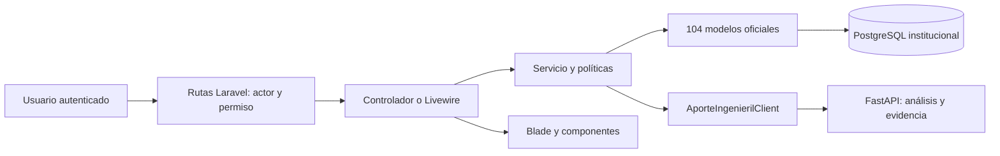
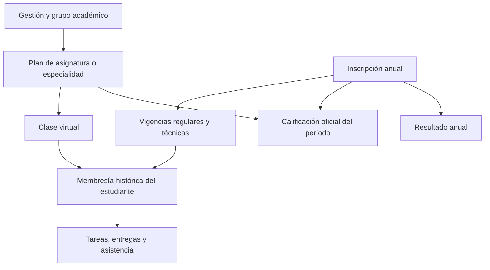

# Mapa funcional de SAVP

## 1. Capas

Laravel gestiona identidad, permisos, historia escolar, LMS y presentación. PostgreSQL conserva hechos y decisiones institucionales. FastAPI recibe un contrato acotado para orientación y conocimiento; no accede directamente a modelos Eloquent. Las rutas y el servicio deben volver a comprobar el ámbito del estudiante o docente; ocultar un botón no autoriza la operación.

## 2. Sistema administrativo

Entrada: `routes/web.php` incluye `routes/admin.php` y `routes/actors.php`. El primero reúne módulos del Administrador; el segundo agrega Dirección, Secretaría, Regencia, Docentes y Estudiantes. `routes/workspace_domains.php` aporta dominios de consulta. `RoleDashboardResolver` y `WorkspaceNavigation` resuelven inicio y menú según el usuario.

Función: registrar y consultar personas, personal, estudiantes, gestión, curso, grupo, inscripción, planes, horarios, notas, asistencia, documentación, resultados y reportes. Interfaces principales: `app/Livewire/Admin`, `app/Http/Controllers/Admin`, `resources/views/livewire/admin`, `resources/views/admin`. La lógica de negocio vive en servicios como `InscripcionAcademicaService` y `GradeService`; las políticas y middleware mantienen actor y permiso.

## 3. Aula virtual

Entrada: `routes/aula_virtual.php`, prefijo `/aula-virtual`. Exige usuario autenticado, verificado, actor Docente o Estudiante y permiso `Acceso_Aula_Virtual`; cada acción añade permisos propios. Sus controladores están en `app/Http/Controllers/AulaVirtual`, componentes en `app/Livewire/AulaVirtual`, servicios en `app/Services/AulaVirtual`, y vistas en `resources/views/aula-virtual` y `resources/views/livewire/aula-virtual`.

Función: mostrar clases autorizadas, materiales, tareas, entregas, intentos, retroalimentación, cuestionarios, foros y asistencia. `CursoVirtualService` comprueba perfil y membresía; `EntregaService` gestiona entregas y calificación de tareas. La calificación de una tarea y la calificación oficial trimestral son hechos distintos: consultar sus modelos y servicios antes de combinarlas.

## 4. Unión entre ambos sistemas

| Aspecto | Administración | Aula virtual |
|---|---|---|
| Quién actúa | Personal con rol y permiso institucional. | Docente o estudiante con permiso y vínculo académico vigente. |
| Qué organiza | Personas, inscripciones, grupos, planes, horarios, notas oficiales y cierres. | Clases, materiales, tareas, entregas, cuestionarios, foros y asistencia. |
| Qué registra | Decisiones e historial institucional. | Actividad de enseñanza y aprendizaje, asociada a una clase y fechas. |
| Punto de unión | Inscripción, vigencia, plan y docente. | Clase virtual y membresía asociadas al plan y estudiante. |
| Entrada técnica | `routes/admin.php`, rutas de actor, `app/Livewire/Admin`. | `routes/aula_virtual.php`, `app/Livewire/AulaVirtual`. |

Ejemplo: Administración registra inscripción de 2026 y grupo. Un plan de ese grupo habilita clase virtual; el estudiante aparece si su membresía y vigencia corresponden. El docente publica una tarea y registra su entrega. La nota de tarea permanece en el LMS; la nota oficial del trimestre se registra y valida aparte. Orientación puede utilizar esos hechos como evidencia sin modificar su origen.

Administración configura plan y trayectoria. Aula virtual utiliza la clase enlazada al plan y la membresía correspondiente. El mismo estudiante puede tener una inscripción anual, un trayecto regular y hasta uno técnico simultáneo. La técnica complementa la formación regular; `cod_esp_tec` distingue contexto técnico en `inscripcion_vigencia`. Un cambio de grupo o especialidad cierra una vigencia y abre otra: no reinterpreta hechos previos. Las reglas físicas y fechas están en migraciones y en [03-DATOS-Y-OPERACION.md](03-DATOS-Y-OPERACION.md).

## 5. Estudiante y aporte

`routes/estudiante.php` expone `/estudiante/intereses`, futuro, preparación, plan y asistente; aula virtual ofrece también `/aula-virtual/mi-orientacion`. `StudentOrientationService` reúne notas regulares, historial, asistencia, actividad y orientación existentes, exige perfil estudiantil activo y verifica preparación del contrato. `AporteIngenierilClient` comunica con FastAPI. El servicio de Python analiza evidencia y devuelve resultados versionados. La consulta del tutor o una sugerencia no altera por sí sola una decisión oficial. Detalle en [04-APORTE-Y-METODOLOGIA.md](04-APORTE-Y-METODOLOGIA.md).

## 6. Dónde empezar según síntoma

| Síntoma | Primer archivo | Revisar después |
|---|---|---|
| 403 de estudiante | `routes/estudiante.php`, `StudentOrientationService::student` | `CursoVirtualService::estudianteDeUsuario`, vínculo usuario/persona/estudiante y permiso. |
| Clase o tarea invisible | `routes/aula_virtual.php`, `CursoVirtualService` | Plan, membresía, fecha, actor y políticas. |
| Nota incorrecta | `GradeService` | Inscripción, PAS/PES, período, fecha académica y migración de contexto. |
| Análisis no disponible | `StudentOrientationService`, `AporteIngenierilClient` | Configuración, contrato, salud FastAPI y trazas. |
| Vista inconsistente | Blade/Livewire de esa pantalla | `DESIGN.md`, tokens CSS y `themeManager`. |
