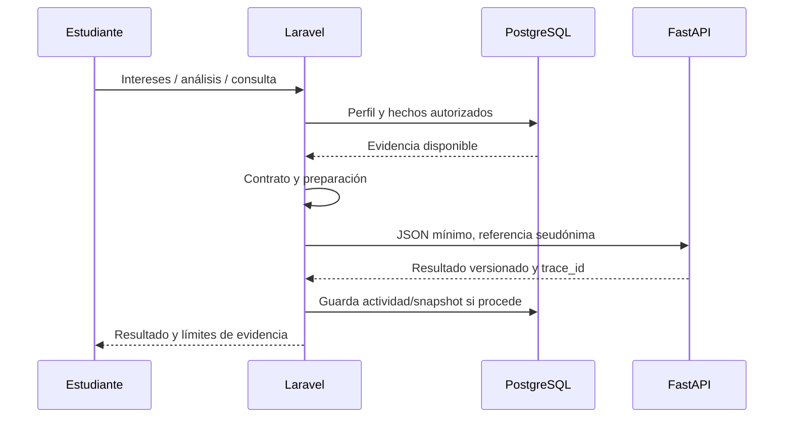

# Aporte académico vocacional y metodología

## 1. Límite entre sistemas

Laravel conserva identidad, autorización y hechos escolares. `StudentOrientationService` reúne únicamente los datos necesarios del estudiante autorizado: notas, historial, evidencia técnica, asistencia y actividad existente. `OrientationReadiness` indica si el perfil contiene evidencia suficiente. `AporteIngenierilClient` valida contrato, configuración, host permitido, tiempo de espera y respuesta; transforma `student_id` en referencia HMAC antes del envío. FastAPI en `ai-service/` procesa JSON; no consulta PostgreSQL ni recibe modelos Eloquent.

La conexión se configura en `config/services.php` mediante variables `APORTE_INGENIERIL_*`. Los endpoints reales se localizan en `AporteIngenierilClient` y `ai-service/app/api/`: instrumento y puntaje RIASEC V2, análisis V2, búsqueda de fuentes y consulta del tutor. Cuando FastAPI falla o el contrato no valida, la respuesta indica indisponibilidad; no inventa puntajes ni elimina el cuestionario ya guardado.

## 2. Orientación y conocimiento

La orientación local usa tablas `orientacion_*`, carreras, universidades y fuentes. El aporte calcula o explica a partir de evidencia declarada y académica. RIASEC describe intereses; rendimiento y preparación describen hechos diferentes. Las ofertas universitarias necesitan procedencia y versiones: una sugerencia no es admisión, aptitud ni decisión institucional. El tutor estructurado puede citar evidencia o abstenerse; la generación local con LLM es opcional y no debe alterar el cálculo determinista.

Dos caminos de entrada actuales comparten la integración: `/estudiante/intereses` y `/aula-virtual/mi-orientacion`. Para la gobernanza de fuentes existe `/conocimiento`, limitado a Administrador/Director según permiso; la revisión requiere Administrador. Ver [flujo de fuentes](../aporte-ingenieril/KNOWLEDGE_GOVERNANCE.md) cuando ese sea el módulo afectado.

## 3. Metodología del aporte

**DSRM** organiza identificación del problema, objetivos, diseño del artefacto, demostración, evaluación y comunicación. En código se traduce en contratos versionados, instrumentos, análisis reproducible, corpus trazable y pruebas/evaluaciones. [Trazabilidad DSRM](../peter3/DSRM_TRACEABILITY.md) vincula cada fase con evidencia y sus límites.

**ICONIX** organiza el desarrollo del sistema SAVP completo. No equivale al algoritmo de orientación. La [nota de alcance ICONIX](../peter3/ICONIX_SCOPE.md) distingue el proceso global de la evaluación de robustez de recomendaciones. No afirmar validación psicométrica, resultados educativos ni funcionamiento de un LLM por el solo hecho de que una prueba técnica pase.

## 4. Lectura selectiva

| Trabajo | Documento detallado |
|---|---|
| Contratos HTTP y estados | [PETER2_INTEGRATION_CONTRACT.md](../peter3/PETER2_INTEGRATION_CONTRACT.md), `app/Services/AporteIngenieril/DTO`. |
| Modelo y límites de análisis | [ARCHITECTURE.md](../peter3/ARCHITECTURE.md), [AFFINITY_VS_PREPARATION.md](../peter3/AFFINITY_VS_PREPARATION.md). |
| Instrumento RIASEC | [RIASEC_IMPLEMENTATION.md](../peter3/RIASEC_IMPLEMENTATION.md). |
| Fuentes, corpus y tutor | [SOURCE_GOVERNANCE.md](../peter3/SOURCE_GOVERNANCE.md), [TUTOR_ARCHITECTURE.md](../peter3/TUTOR_ARCHITECTURE.md). |
| Ejecución Python | [ai-service/README.md](../../ai-service/README.md). |

Los informes de fase describen el estado de su fecha. Antes de afirmar que un endpoint, corpus o runtime está disponible hoy, comprobar código, configuración y salud del servicio.
